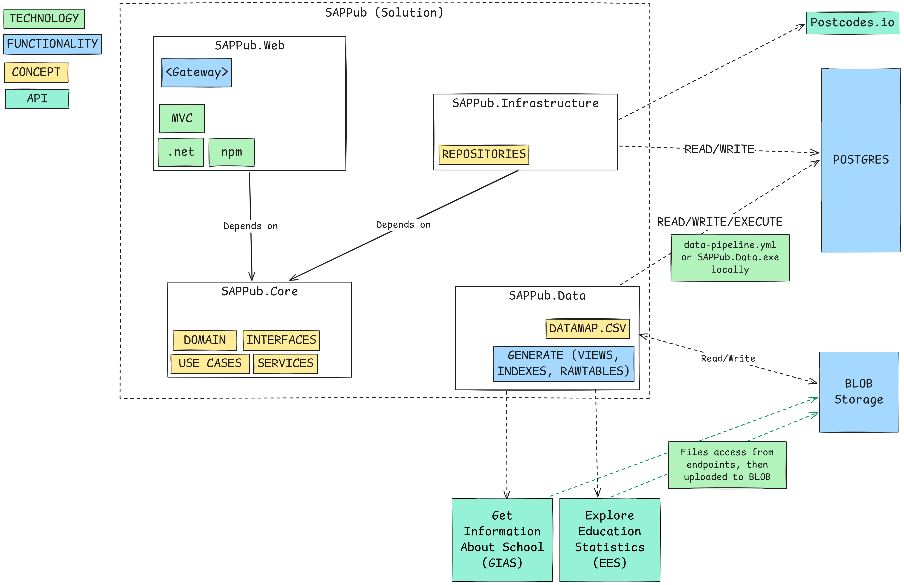
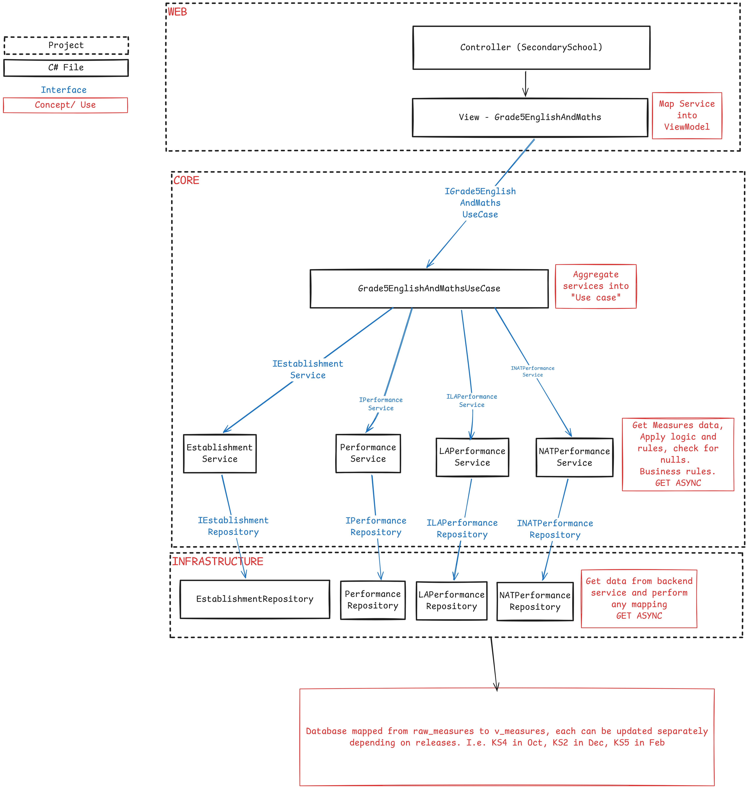

# Architecture overview

SAPPub currently uses the following approach to architecture: 

The main entry point to the application is as an ASPNet application (net8 as of first writing), exposing MVC web endpoints. 

The SAPPub application is intended as an almost entirely read-only public-facing website, hence no API, or Authentication mechanism. 
A caveat to this exists in the Gateway which uses email and timers to restirct access in the private beta phase, this will be removed when the application goes Public Beta. 

## The SAPPub.Core contains the 
* Core entities/Domain entities
    * As of writing, these map to the publications of the DfE Performance, Absence, Pupil Population, etc, and also an Establishment (School/College)
    * In future this will be revisited and possibly tied more to Measures (Progress 8, Grade 5 and Above in English and Maths) etc. 
    * Either of these are Business concepts that should be well known within the DfE. 
* Interfaces - To enable Dependency Inversion, all interfaces should live in the Core and be explicitly implemented in their own section as applicable.
* Use Cases - These are being introduced to streamline the access of specific measures and ideas ready for the UI or any other consumer (should the service turn into a Mobile app or whatever may be dreamed of). 
* Services - These services apply any business logic or checking that each Model needs in preparation for use by UI/Use cases.

## SAPPub.Infrastructure 

Is the interactor with the data and external services

* Repositories live here, each currently accessing the datasets mapped out elsewhere and performing any checks or calculations on them to prepare for the Core/Services to use them. May entirely be replaced by Generic Implemntations for CRUD. 

## SAPPub.Data

To provide data in a reliable and ready format, the Data project was created; originally to source and transform the data and eventually to provide a full ETL process for the data SAPPub needs. 

* Data is stored in a Datamap.csv file, this is a copy of the master data spreadsheet used in the SIP Programme in which all the data points required are stored together. The goal of this is the following: every few months during a publication cycle, the data will need to change or be updated, this can be done by anyone with business knowledge and then handed to the pipeline to be transformed. 
* Once the DataMap is updated, the raw_sources.json can be updated and the pipeline ran. 
* This will download the new files identified, or if they have been updated on Explore Education Statistics (EES) replaced, into Azure BLOB for storage.
* Then the scripts will create raw tables, and materialised views based off the data mapping. 

## Full application flow

The follow diagram is an aspirational workflow for data in SAPPub.

This diagram hopefully explains the flow through the application so that measures, or establishment data can be surfaced to the UI. This design is a hybrid of approaches and may change as the development enters difference phases, but currently is the planned approach.