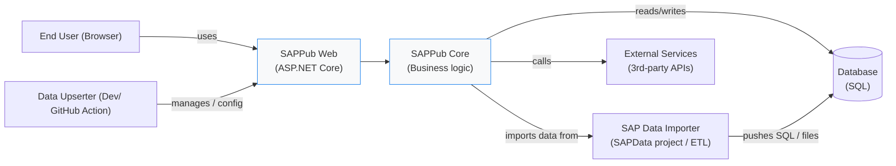
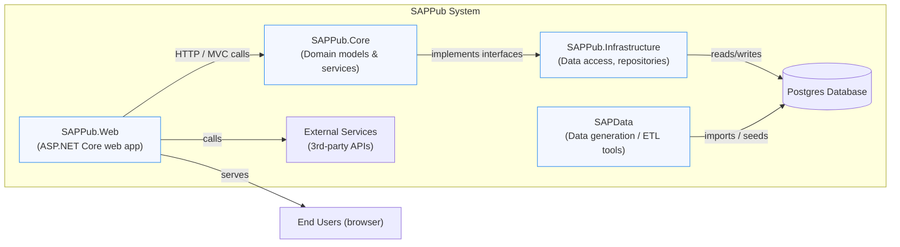
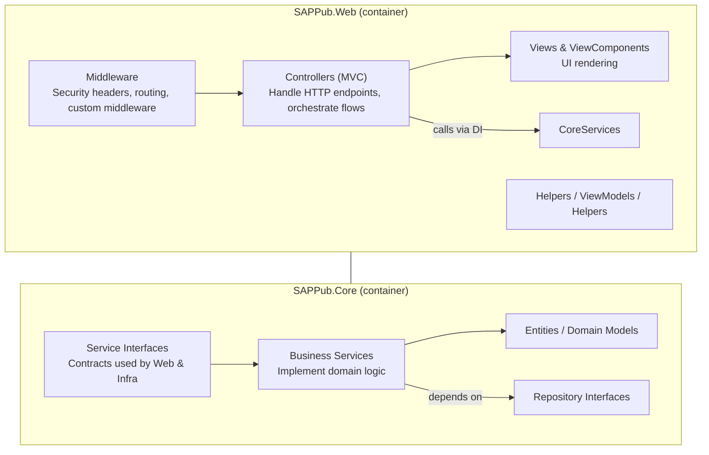

# C4 Diagrams

> Generated by CoPilot, modified to be more accurate.

## System Context

The diagram below shows the System Context (C1) for the SAPPub project: primary users, system boundaries, and external systems the project interacts with.

Summary (at-a-glance):

- Primary users: `End User` (site visitors) and `Data Upserter` (Dev/ Github Action).
- In-scope system: `SAPPub Web` (UI/API) and `SAPPub Core` (domain logic). These form the SAPPub system boundary.
- External systems: `SAPData` importer (data ingestion), Database (persistent storage), and other external APIs.
- Main interactions: users interact via browser → SAPPub Web → Core → Database; data ingestion runs via `SAPData` into the DB; the project does not include an OAuth/OpenID Connect provider.

Authentication status: there is currently no OAuth/OpenID Connect or external SSO configured in the codebase (no `AddAuthentication` / `UseAuthentication` present in `Program.cs`). If authentication is required later, wire an external IdP or add an auth layer and update this diagram.

Use this file as the canonical System Context diagram and update it when external integrations or actors change.

## Containers (C2)

The container diagram shows the major runnable components (containers) that make up the SAPPub system.

- Purpose: shows what runs where and how data flows between containers.
- Key containers: `SAPPub.Web` (serves UI & server logic), `SAPPub.Core` (business logic), `SAPPub.Infrastructure` (persistence), `SAPData` (data tooling), and the `Postgres` database.

## Components (C3)

The component diagram drills into the primary containers to show major internal components and responsibilities. Below focuses on `SAPPub.Web` and `SAPPub.Core`.

- How to read: Controllers in `SAPPub.Web` implement user-facing endpoints and delegate to `SAPPub.Core` service interfaces. `SAPPub.Infrastructure` provides concrete repository implementations wired into DI at startup.
- Security note: this project currently has no application-level OAuth/OpenID Connect provider configured — authentication is intentionally not present in the codebase.

Update these diagrams as architecture or runtime responsibilities change (e.g., add a background worker, caching layer, or an external auth provider).

