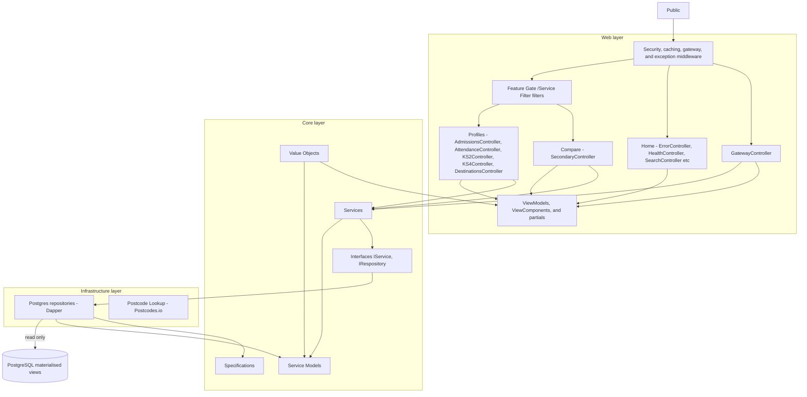
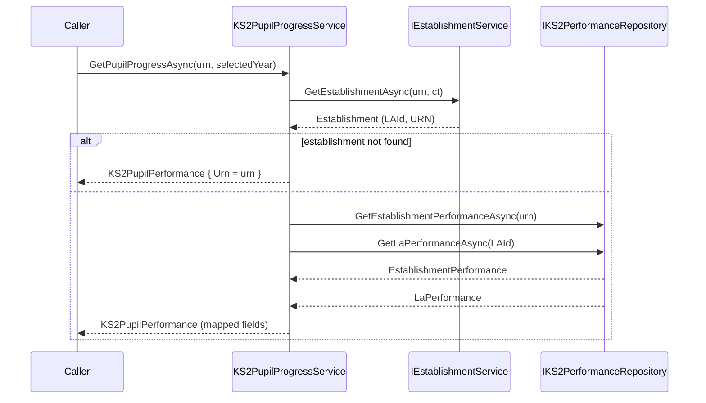
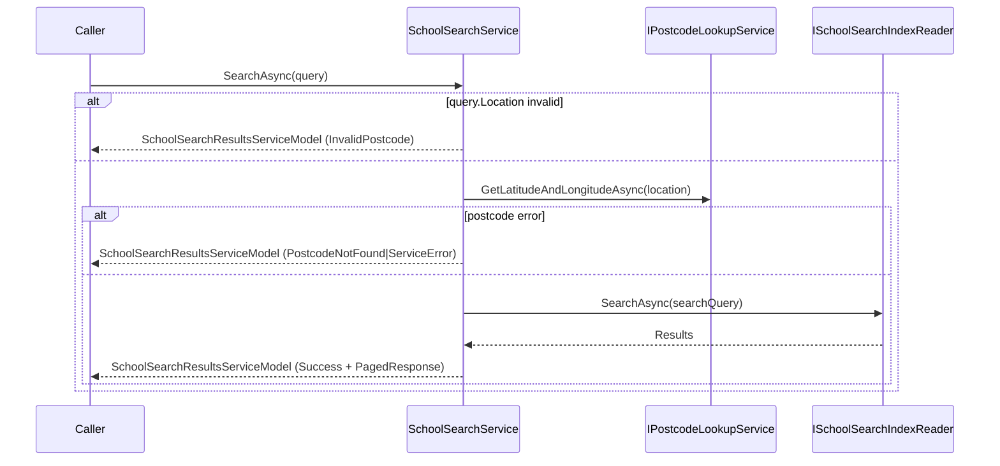
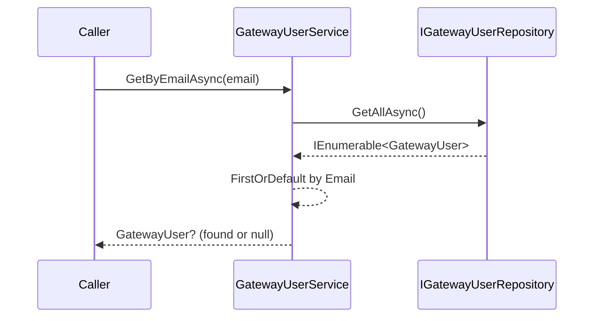
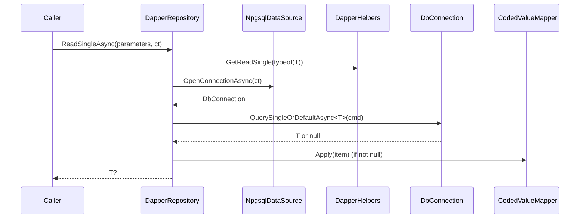
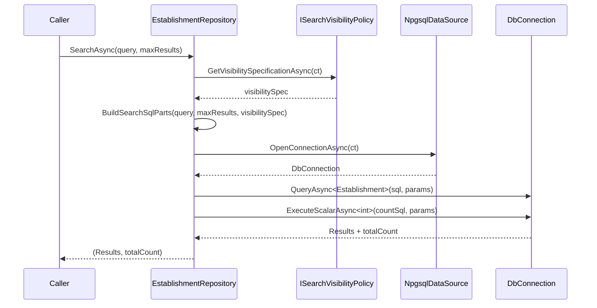

# SAP Public - Low-Level Design (LLD)

* **Repository:** `DFE-Digital/sap-public`
* **Original source** https://github.com/DFE-Digital/sap-sector/blob/main/docs/architecture/low-level-design.md
* **Source author:** Hari Dupati
* **Updates from:** Dan Murfitt
* **Last updated:** 2026-09-09

---

## Contents

1. [Purpose and scope](#1-purpose-and-scope)
2. [Route map](#2-route-map)
3. [Search](#3-search)
4. [Feature flag behaviour](#4-feature-flag-behaviour)
5. [Request flows](#5-request-flows)
6. [C4 Level 3, component view](#6-c4-level-3-component-view)
7. [Controllers](#7-controllers)
8. [Services](#8-services)
9. [Repositories](#9-repositories)
10. [Data pipeline dependency](#10-data-pipeline-dependency)
11. [Test coverage](#11-test-coverage)

---

## 1. Purpose and scope

This document covers the low-level design of the SAP Public service. It describes the layered architecture, the search pipeline, middleware, error handling and testing patterns.

For the system boundary, data flows and C4 levels 1 and 2, see the [High-Level Design](./002-high-level-design.md).

---

## 2. Route map

### Profiles

| Page | Sub-page | Filter | Root | URL |
|------|----------|--------|------|-----|
| Overview |  |  | /school/$urn/$school-name | /overview |
| About the school |  |  | /school/$urn/$school-name | /about |
| Admissions |  |  | /school/$urn/$school-name | /admissions |
|  | Primary |  | /school/$urn/$school-name | /admissions/primary |
|  | Secondary |  | /school/$urn/$school-name | /admissions/secondary |
| Curriculum and extra-curricular activities |  |  | /school/$urn/$school-name | /curriculum |
|  | Primary |  | /school/$urn/$school-name | /curriculum/primary |
|  | Secondary |  | /school/$urn/$school-name | /curriculum/secondary |
| Attendance |  |  | /school/$urn/$school-name | /attendance |
| Primary academic performance |  |  | /school/$urn/$school-name | /primary-performance |
|  | Pupil Progress |  | /school/$urn/$school-name | /primary-performance/pupil-progress |
|  |  | Current | /school/$urn/$school-name | /primary-performance/pupil-progress/current |
|  |  | Previous | /school/$urn/$school-name | /primary-performance/pupil-progress/previous |
|  |  | Previous2 | /school/$urn/$school-name | /primary-performance/pupil-progress/previous2 |
|  | Meeting or exceeding standards |  | /school/$urn/$school-name | /primary-performance/meeting-or-exceeding-standards |
|  | Subject scaled scores |  | /school/$urn/$school-name | /primary-performance/subject-scaled-scores |
|  | Additional measures |  | /school/$urn/$school-name | /primary-performance/additional-measures |
| Secondary academic performance |  |  | /school/$urn/$school-name | /secondary-performance |
|  | Progress and attainment |  | /school/$urn/$school-name | /secondary-performance/progress-attainment |
|  |  | Current | /school/$urn/$school-name | /secondary-performance/progress-attainment/current |
|  |  | Previous | /school/$urn/$school-name | /secondary-performance/progress-attainment/previous |
|  |  | Previous2 | /school/$urn/$school-name | /secondary-performance/progress-attainment/previous2 |
|  | English and maths results |  | /school/$urn/$school-name | /secondary-performance/english-and-maths |
|  |  | Grade7 | /school/$urn/$school-name | /secondary-performance/english-and-maths/grade-7-and-above |
|  |  | Grade5 | /school/$urn/$school-name | /secondary-performance/english-and-maths/grade-5-and-above |
|  |  | Grade4 | /school/$urn/$school-name | /secondary-performance/english-and-maths/grade-4-and-above |
|  | Subject entered |  | /school/$urn/$school-name | /secondary-performance/subjects-entered |
|  | Additional measures |  | /school/$urn/$school-name | /secondary-performance/additional-measures |
| 16-19 academic performance |  |  | /school/$urn/$school-name | /16-to-19-performance |
|  | Advanced level qualifications (level 3) |  | /school/$urn/$school-name | /16-to-19-performance/level-3-qualifications |
|  |  | Alevel | /school/$urn/$school-name | /16-to-19-performance/level-3-qualifications/alevel |
|  |  | Academic | /school/$urn/$school-name | /16-to-19-performance/level-3-qualifications/academic |
|  |  | AppliedGeneral | /school/$urn/$school-name | /16-to-19-performance/level-3-qualifications/appliedgeneral |
|  |  | TechLevel | /school/$urn/$school-name | /16-to-19-performance/level-3-qualifications/techlevel |
|  |  | Apprenticeships | /school/$urn/$school-name | /16-to-19-performance/level-3-qualifications/apprenticeship |
|  | Intermediate level qualifications (level 2) |  | /school/$urn/$school-name | /16-to-19-performance/level-2-qualifications |
|  |  | TechCertificates | /school/$urn/$school-name | /16-to-19-performance/level-2-qualifications/techcert |
|  |  | Apprenticeships | /school/$urn/$school-name | /16-to-19-performance/level-2-qualifications/apprenticeship |
|  | English and maths |  | /school/$urn/$school-name | /16-to-19-performance/english-and-maths |
|  | Subject entered |  | /school/$urn/$school-name | /16-to-19-performance/subjects-entered |
|  |  | Allqualifications | /school/$urn/$school-name | /16-to-19-performance/subjects-entered/allqualifications |
|  |  | Academicqualifications | /school/$urn/$school-name | /16-to-19-performance/subjects-entered/academicqualifications |
|  |  | Vocationalandtechnicalqualifications | /school/$urn/$school-name | /16-to-19-performance/subjects-entered/vocationalandtechnicalqualifications |
| Destinations |  |  | /school/$urn/$school-name | /destinations |
|  | Secondary |  | /school/$urn/$school-name | /destinations/secondary |
|  | Education, apprenticeships or work (2023 leavers) |  | /school/$urn/$school-name | /destinations/16-to-19 |
|  | Higher-level study (2022 leavers) |  | /school/$urn/$school-name | /destinations/16-to-19-higher-level-study |
| Search |  |  |  | /search |
|  | Results |  |  | /search/results |

### Comparison

| Page | Sub-page | Filter | Root | URL |
|------|----------|--------|------|-----|
| Compare secondary | About your schools |  | /compare/secondary/ | /about-your-schools |
|  | Academic performance - Pupil attainment |  | /compare/secondary/ | /pupil-attainment |
|  | Academic performance - English and Maths results |  | /compare/secondary/ | /english-and-maths-results |
|  | Destinations after year 11 |  | /compare/secondary/ | /destinations-after-year-11 |
|  | Next steps |  | /compare/secondary/ | /next-steps |

---

## 3. Search

Searching is performed in the `SchoolSearchService` with the following summary:

*	Purpose: Orchestrates a search for schools based on a user query (name, location/postcode, distance, page, (filter) phase, (filter) establishment type) and returns a paged, typed result (SchoolSearchResultsServiceModel).
*	Dependencies: ISchoolSearchIndexReader (search index access) and IPostcodeLookupService (geocoding/postcode-to-latlong).
*	Main flow (SearchAsync):
*	Normalize page number (default 1).
*	If a location/postcode is provided, validate it against a UK postcode regex.
*	If validation fails, return an empty paged response with Status = InvalidPostcode.
*	If postcode is valid, call postcodeLookupService.GetLatitudeAndLongitudeAsync (wrapper around Postcodes.io service).
*	If postcode lookup returns an error, return an empty paged response with Status mapped to PostcodeNotFound or PostcodeServiceError.
*	Otherwise extract latitude/longitude for geospatial search.
*	Build a SearchQuery object (name, latitude/longitude, distance, page, page size).
*	Call schoolSearchIndexReader.SearchAsync with the query.
*	Map index results to SchoolSearchResultServiceModel (via ToSchoolSearchResult extension) and build a PagedResponse with Pager info and Status = Success.
*	Pagination: uses Constants.PageSize and a Pager object to construct pager metadata; page number is controlled by query.PageNumber.
*	Error handling/statuses: returns explicit statuses (InvalidPostcode, PostcodeNotFound, PostcodeServiceError, Success) to let callers distinguish failure modes.
*	Implementation details: fully asynchronous, relies on mapping extension methods and service models (SearchQuery, PagedResponse, Pager, result DTOs).

In the SapData project, we calculate if an establishment has a KS2, KS4, and/or KS5 component, and report these back upon table instantiation.


---

## 4. Feature flag behaviour

The flags are currently `Enable16to19` and `EnablePrimary`, managed through `Microsoft.FeatureManagement`. Secondary has no equivalent flag.

| Component                                           | When flag is off                     |
| --------------------------------------------------- | ------------------------------------ |
| `[FeatureGate("$flag")]` on any controller method | HTTP 404 method
| `_featureManager.IsEnabledAsync(Constants.Constants.$flag$)`                 | Phase is removed in search results |

These flags will be removed as we progress towards go-live as they were intended to filter out areas of the website not yet public (for private beta audiences).

---

## 5. Request flows

### 6.1 KS2 performance page

This traces `GET school/{urn}/{schoolName}/primary-performance/meeting-or-exceeding-standards`, which is the an example flow for the application architecture.

```
[Area(Profiles)]          → MVC Area management
[FeatureGate(Constants.Constants.EnablePrimary)]      → flag on? proceed | off → 404
[ServiceFilter(typeof(PrimaryQueryValidationFilter))]      → Does the URN have a KS2 component? -> Allow through, and pass EstablishmentMinimum model to Controller
                          → If not -> 404

KS2Controller.AcademicPerformanceMeetingOrExceedingStandards(urn)
  └─ [FromServices] IKS2MeetingOrExceedingStandardsService
  └─ urn (string)
  └─ schoolName (string)
  └─ GetMeetingOrExceedingStandardsPercentages(urn, Establishment.LAId))
       └─ IKS2PerformanceRepository
            ├─ GetEstablishmentPerformanceAsync(urn)
                └─ IGenericRepository<type>.ReadAsync(urn)
                │    → v_establishment_ks2_attainment
            ├─ GetLaPerformanceAsync(urn)
                └─ IGenericRepository<type>.ReadAsync(urn)
                │    → v_la_ks2_attainment
            ├─ GetEnglandPerformanceAsync(urn)
                └─ IGenericRepository<type>.ReadAsync(urn)
                │    → v_england_ks2_attainment
       └─ new KS2MeetingOrExceedingStandardsModel (mapping)
            → 7x helper methods (each containing ThreeYearAverage in the form RelativeYearValues<CodedDouble>)
            → 20x property maps
  └─ AcademicPerformanceMeetingOrExceedingStandardsViewModel { EstablishmentMinimumServiceModel, KS2MeetingOrExceedingStandardsModel }
  └─ View("AcademicPerformanceMeetingOrExceedingStandards")
       → renders VerticalNavigation (shared component)
       →  2 x ChartWithTableToggle (partial)
       →  5 x _MeetingExceedingStandardsTable (partial)
       →  1 x _LowMediumHighPriorAttainers (partial)
       → renders SchoolProfilePagination (shared component)
```

Other journeys are similar, or will be being moved into this pattern. 


## 6. C4 Level 3, component view

This is the component view of the web application. The container view sits in the HLD.



*Figure 1. C4 level 3, components inside the web application.*

The layering matters here. Controllers never talk to a repository directly. Services depend on interfaces defined in Core, and Infrastructure supplies the implementations. That is what keeps Postgres out of the business logic.

---

## 7. Controllers


### HomeController

|Action|Route|Model returned|
|---|---|---|
|Index|(default)|View() — no model|

### CookiesController

|Action|Route|Model returned|
|---|---|---|
|Preferences (GET)|/Cookies/Preferences|CookiesViewModel (View)|
|CookieSettings (POST)|/Cookies/CookieSettings|RedirectResult|
|HideBanner|/Cookies/HideBanner|RedirectResult|

### ErrorController
|Action|Route|Model returned|
|---|---|---|
|Throw|/Error/Throw|NotFound() or throws exception|
|HandleErrorCode|/error/{statusCode:int}|View("PageNotFound" / "ProblemWithService")|
HealthController (API)
|Action|Route|Model returned|
|GetAsync (GET)|/Health|HealthCheckResponse (JSON) — Ok(...) or 500 with HealthCheckResponse|


### HelpController
|Action|Route|Model returned|
|---|---|---|
|TermsAndConditions|/terms-and-conditions|View() — no model|

### MySchoolsController

|Action|Route|Model returned|
|---|---|---|
|Index (GET)|/my-schools/view (RouteConstants.MySchoolsView)|
MySchoolsListViewModel (View)|
|NoSchoolsAdded (GET)|/my-schools/no-schools-added (RouteConstants.MySchoolsNoSchoolsView)|View() — no model|
|Index (POST)|/my-schools/view (POST)|RedirectResult or View(MySchoolsListViewModel)|
|RemoveConfirm (GET)|/my-schools/remove-confirm (RouteConstants.MySchoolsRemoveConfirm)|RemoveSchoolsConfirmationViewModel (View)|
|ConfirmRemove (POST)|/my-schools/remove-confirm (POST)|RedirectResult|

### MySchoolsListController
|Action|Route|Model returned|
|---|---|---|
|ToggleSaveEstablishment (POST)|/MySchoolsList/ToggleSaveEstablishment|JsonResult (AJAX) or RedirectResult|

### SchoolController
|Action|Route|Model returned|
|---|---|---|
|Index (urn only)|/school/{urn}|RedirectToRoute (overview/about)|
|Index (urn + schoolName)|/school/{urn}/{schoolName}|RedirectToRoute|
|Schools|/map/schools/{urn}|Json { name, lat, lon } (JsonResult)|

### SearchController
|Action|Route|Model returned|
|---|---|---|
|Index (GET)|/search (RouteConstants.Search)|SearchResultsViewModel (View)|
|Index (POST)|/search (POST)|RedirectToAction or View(SearchResultsViewModel)|
|SearchResults (GET)|/search/results (RouteConstants.SearchResults)|SearchResultsViewModel (View)|

### GatewayController (Area: Gateway)
|Action|Route|Model returned|
|---|---|---|
|Welcome (GET)|/gateway/welcome/{id}|GatewayWelcomeViewModel (View)|
|Welcome (POST)|/gateway/welcome/{id} (POST)|View(GatewayWelcomeViewModel) or Redirect|
|Returning (GET)|/gateway/returning/{id}|GatewayReturningViewModel (View)|
|Returning (POST)|/gateway/returning/{id} (POST)|View(GatewayReturningViewModel) or Redirect|
|NewVisitor (GET)|/gateway/newvisitor/{id}|GatewayNewUserViewModel (View)|
|NewVisitor (POST)|/gateway/newvisitor/{id} (POST)|View(GatewayNewUserViewModel) or Redirect|

### AboutController (Area: Profiles)
|Action|Route|Model returned|
|---|---|---|
|AboutSchool|/school/{urn}/{schoolName}/about (RouteConstants.AboutTheSchool)|AboutSchoolViewModel (View)|

### AdmissionsController (Area: Profiles)
|Action|Route|Model returned|
|---|---|---|
|Index|/school/{urn}/{schoolName}/admissions (RouteConstants.AdmissionsRoot)|Redirect to KS2/KS4 or View("Error")|
|KS2 (GET)|/school/{urn}/{schoolName}/admissions/primary (RouteConstants.PrimaryAdmissions)|AdmissionsViewModel (View)|
|KS4 (GET)|/school/{urn}/{schoolName}/admissions/secondary (RouteConstants.SecondaryAdmissions)|AdmissionsViewModel (View)|


### AttendanceController (Area: Profiles)
|Action|Route|Model returned|
|---|---|---|
|Attendance|/school/{urn}/{schoolName}/attendance (RouteConstants.Attendance)|AttendanceViewModel (View)|

### CurriculumController (Area: Profiles)
|Action|Route|Model returned|
|---|---|---|
|Index|/school/{urn}/{schoolName}/curriculum (RouteConstants.CurriculumRoot)|Redirect to KS2/KS4 or View("Error")|
|KS2 (GET)|/school/{urn}/{schoolName}/curriculum/primary (RouteConstants.PrimaryCurriculumAndExtraCurricularActivities)|CurriculumAndExtraCurricularActivitiesViewModel (KS2) (View)|
|KS4 (GET)|/school/{urn}/{schoolName}/curriculum/secondary (RouteConstants.SecondaryCurriculumAndExtraCurricularActivities)|CurriculumAndExtraCurricularActivitiesViewModel (KS4) (View)|


### DestinationsController (Area: Profiles)
|Action|Route|Model returned|
|---|---|---|
|Index|/school/{urn}/{schoolName}/destinations (RouteConstants.DestinationsRoot)|Redirect to KS4/KS5 or View("Error")|
|KS4|/school/{urn}/{schoolName}/destinations/secondary (RouteConstants.SecondaryDestinations)|KS4DestinationsViewModel (View)|
|KS5|/school/{urn}/{schoolName}/destinations/16-to-19 (RouteConstants.KS5Destinations)|KS5DestinationsViewModel (View)|
|KS5Higher|/school/{urn}/{schoolName}/destinations/16-to-19-higher-level-study (RouteConstants.KS5DestinationsHigher)|AboutSchoolViewModel (View)|
OverviewController (Area: Profiles)
|Action|Route|Model returned|
|Overview|/school/{urn}/{schoolName}/overview (RouteConstants.Overview)|OverviewViewModel (View)|

### KS2Controller (Area: Profiles)
|Action|Route|Model returned|
|---|---|---|
|AcademicPerformancePupilProgress (GET redirect)|/school/{urn}/{schoolName}/primary-performance/pupil-progress (RouteConstants.PrimaryAcademicPerformancePupilProgress)|Redirect to action with year route segment|
|AcademicPerformancePupilProgress (GET)|/school/{urn}/{schoolName}/primary-performance/pupil-progress/{selectedAcademicYearName}|AcademicPerformancePupilProgressViewModel (View)|
|AcademicPerformanceMeetingOrExceedingStandards|/school/{urn}/{schoolName}/primary-performance/meeting-or-exceeding-standards (RouteConstants.PrimaryAcademicPerformanceMeetingOrExceedingStandards)|AcademicPerformanceMeetingOrExceedingStandardsViewModel (View)|
|AcademicPerformanceSubjectScaledScores|/school/{urn}/{schoolName}/primary-performance/subject-scaled-scores (RouteConstants.PrimaryAcademicPerformanceSubjectScaledScores)|AcademicPerformanceSubjectScaledScoresViewModel (View)|
|AcademicPerformanceAdditionalMeasures|/school/{urn}/{schoolName}/primary-performance/additional-measures (RouteConstants.PrimaryAcademicPerformanceAdditionalMeasures)|AcademicPerformanceAdditionalMeasuresViewModel (View)|

### KS4Controller (Area: Profiles)
|Action|Route|Model returned|
|---|---|---|
|AcademicPerformanceAttainmentAndProgress (redirect)|/school/{urn}/{schoolName}/secondary-performance/progress-attainment (RouteConstants.SecondaryAcademicPerformanceAttainmentAndProgress)|Redirect to route with year segment|
|AcademicPerformanceAttainmentAndProgress (GET)|/school/{urn}/{schoolName}/secondary-performance/progress-attainment/{selectedAcademicYearName}|AcademicPerformanceAttainmentAndProgressViewModel (View)|
|AcademicPerformanceEnglishAndMathsResults (redirect)|/school/{urn}/{schoolName}/secondary-performance/english-and-maths (RouteConstants.SecondaryAcademicPerformanceEnglishAndMathsResults)|Redirect to filtered route|
|AcademicPerformanceEnglishAndMathsResults (GET)|/school/{urn}/{schoolName}/secondary-performance/english-and-maths/{gradeName}|AcademicPerformanceEnglishAndMathsResultsViewModel (View)|
|AcademicPerformanceSubjectsEntered|/school/{urn}/{schoolName}/secondary-performance/subjects-entered (RouteConstants.SecondaryAcademicPerformanceSubjectsEntered)|AcademicPerformanceSubjectsEnteredViewModel (View)|
|AcademicPerformanceAdditionalMeasures|/school/{urn}/{schoolName}/secondary-performance/additional-measures (RouteConstants.SecondaryAcademicPerformanceAdditionalMeasures)|AcademicPerformanceAdditionalMeasuresViewModel (View)|

### KS5Controller (Area: Profiles)
|Action|Route|Model returned|
|---|---|---|
|Index|/school/{urn}/{schoolName}/16-to-19-performance (RouteConstants.KS5AcademicPerformanceRoot)|Redirect to Level3Qualifications|
|Level3QualificationsRedirect|/school/{urn}/{schoolName}/16-to-19-performance/level-3-qualifications (RouteConstants.KS5AcademicPerformanceLevel3)|Redirect|
|Level3Qualifications|/school/{urn}/{schoolName}/16-to-19-performance/level-3-qualifications/{qualification} (RouteConstants.KS5AcademicPerformanceLevel3Filter)|Level3QualificationViewModel (View)|
|Level2QualificationsRedirect|/school/{urn}/{schoolName}/16-to-19-performance/level-2-qualifications (RouteConstants.KS5AcademicPerformanceLevel2)|Redirect|
|Level2Qualifications|/school/{urn}/{schoolName}/16-to-19-performance/level-2-qualifications/{qualification} (RouteConstants.KS5AcademicPerformanceLevel2Filter)|Level2QualificationViewModel (View)|
|EnglishAndMaths|/school/{urn}/{schoolName}/16-to-19-performance/english-and-maths (RouteConstants.KS5AcademicPerformanceEnglishMaths)|EnglishMathsQualificationsViewModel (View)|
|SubjectsEnteredRedirect|/school/{urn}/{schoolName}/16-to-19-performance/subjects-entered (RouteConstants.KS5AcademicPerformanceSubjectsEntered)|Redirect|
|SubjectsEntered|/school/{urn}/{schoolName}/16-to-19-performance/subjects-entered/{qualification} (RouteConstants.KS5AcademicPerformanceSubjectsEnteredFilter)|Ks5SubjectEnteredViewModel (View)|

### Compare -> SecondaryController (Area: Compare)
|Action|Route|Model returned|
|---|---|---|
|AboutYourSchools|/compare/secondary/about-your-schools (RouteConstants.CompareSecondaryAboutYourSchools)|CompareAboutYourSchoolsViewModel (View)|
|AcademicPerformancePupilAttainment|/compare/secondary/pupil-attainment (RouteConstants.CompareSecondaryAcademicPerformancePupilAttainment)|CompareAcademicPerformancePupilAttainmentViewModel (View)|
|AcademicPerformanceEnglishAndMathsResults|/compare/secondary/english-and-maths-results (RouteConstants.CompareSecondaryAcademicPerformanceEnglishAndMathsResults)|CompareAcademicPerformanceEnglishAndMathsResultsViewModel (View)|
|NextSteps|/compare/secondary/next-steps (RouteConstants.CompareSecondaryNextSteps)|CompareNextStepsViewModel (View)|
|Destinations|/compare/secondary/destinations-after-year-11 (RouteConstants.CompareSecondaryDestinations)|CompareDestinationsViewModel (View)|


---

## 8. Services

### Conventions (applies to all services)

- Language / runtime: C# 14 / .NET 10.
- Pattern: DI-injected, stateless services that orchestrate repositories, gateway clients and other services. Services return ServiceModel types defined under SAPPub.Core.ServiceModels.
- Async: Public APIs use async Task/Task<T> and accept CancellationToken. Methods should check ct.ThrowIfCancellationRequested() early and pass the token to downstream calls.
- Validation: Validate inputs (ArgumentException.ThrowIfNullOrWhiteSpace, etc.). Some services return empty service models when not found; others throw NotFoundException. LLD recommends standardizing behavior.
- Value objects: Use CodedDouble, CodedString and other value objects to represent coded/suppressed/missing values and original raw values.
- Parallel calls: Use Task.WhenAll for independent repository/gateway calls to reduce latency.
- Observability: Add ILogger<T> to long-running/orchestration services. Log start/end, unexpected conditions and exceptions.
- Testing: Unit tests should mock repositories/gateways. Cover happy path, not-found, cancellation and error bubbling.

### Inventory (key services documented here)

- EstablishmentService
- LAService
- AttendanceService
- EmailService
- MySchoolsListService
- OverviewService
- SchoolSearchService
- GatewayUserService
- KS2PupilProgressService
- KS2AdditionalMeasuresService
- KS2MeetingOrExceedingStandardsService
- KS2ScaledScoresService

---

### Service: EstablishmentService

- File: SAPPub.Core/Services/EstablishmentService.cs
- Purpose: Provide establishment metadata and lightweight cached minimum information.
- Responsibilities:
  - Query IEstablishmentRepository for establishment entities.
  - Map entities to EstablishmentServiceModel or EstablishmentMinimumServiceModel.
  - Cache results for minimum model using IMemoryCache.
- Dependencies: IEstablishmentRepository, IMemoryCache
- Public methods:
  - Task<IEnumerable<EstablishmentServiceModel>> GetEstablishmentsAsync(int page, int take, CancellationToken ct = default)
  - Task<EstablishmentServiceModel> GetEstablishmentAsync(string urn, CancellationToken ct = default)
  - Task<IEnumerable<EstablishmentServiceModel>> GetEstablishmentsAsync(IEnumerable<string> urns, CancellationToken ct = default)
  - Task<EstablishmentMinimumServiceModel> GetEstablishmentMinimumAsync(string urn, CancellationToken ct = default)
- Data flow: Input URN → repository lookup → map to service model → (cache minimum when requested).
- Error handling: Throws NotFoundException when establishment not found for methods that require an existing establishment.
- Testing notes: Unit tests should mock repository to return a valid entity, null (to trigger NotFoundException) and validate cache behavior for GetEstablishmentMinimumAsync.

---

### Service: LAService

- File: SAPPub.Core/Services/LAService.cs
- Purpose: Resolve Local Authority (LA) URLs/metadata using primary and fallback identifiers (GSS LA code and DistrictAdministrativeId).
- Responsibilities:
  - Query ILaUrlsRepository by GSS LA code and fallback to DistrictAdministrativeId when missing.
  - Aggregate LA URL results for lists of establishments efficiently.
- Dependencies: ILaUrlsRepository
- Public methods:
  - Task<LaUrls?> GetLaUrlsAsync(EstablishmentServiceModel establishment, CancellationToken ct)
  - Task<IEnumerable<LaUrls?>> GetLaUrlsListForEstablishmentsAsync(IEnumerable<EstablishmentServiceModel> establishments, CancellationToken ct)
- Data flow: EstablishmentModel → try GSS code → fallback district id → return LaUrls or null.
- Error handling: Returns null when LA not found; caller must handle nulls.
- Testing notes: Cover both primary and fallback paths; test returned union of results for multiple establishments.

---

### Service: AttendanceService

- File: SAPPub.Core/Services/AttendanceService.cs
- Purpose: Orchestrate attendance/absence data for an establishment, LA and England and produce AttendanceModel for the UI.
- Responsibilities:
  - Validate URN and cancellation token.
  - Fetch establishment minimum model and absence data for establishment, LA and England in parallel.
  - Map coded numeric values into AttendanceModel fields, selecting the correct column based on school phase and special-school status.
- Dependencies: IEstablishmentService, IEstablishmentAbsenceService, IEnglandAbsenceService, ILAAbsenceService
- Public methods:
  - Task<AttendanceModel> GetAttendenceDetailsAsync(string urn, CancellationToken ct = default)
- Data flow: URN → EstablishmentMinimum → parallel absence repository calls → map columns based on phase → AttendanceModel
- Error handling: Returns an AttendanceModel with Urn set and flags false for missing establishment (empty URN case). Unexpected repository exceptions bubble upward.
- Testing notes: Validate special-school, KS4 and KS2 precedence logic via GetCodedValue; cover cancellation.

---

### Service: EmailService

- File: SAPPub.Core/Services/EmailService.cs
- Purpose: Thin wrapper to send gateway emails via IEmailRepository.
- Responsibilities:
  - Validate email address and local authority name.
  - Delegate sending to repository and log errors.
- Dependencies: IEmailRepository, ILogger<EmailService>
- Public methods:
  - void SendGatewayEmail(string emailAddress, string localAuthorityName)
- Data flow: input parameters → validate → repository.SendGatewayEmail
- Error handling: Throws ArgumentException for missing inputs and logs errors before throwing.
- Testing notes: Unit test should verify that invalid inputs cause an exception and that repository is invoked for valid inputs.

---

### Service: MySchoolsListService

- File: SAPPub.Core/Services/MySchoolsListService.cs
- Purpose: Manage cookie-backed "My schools" list for UI comparison features.
- Responsibilities:
  - Read cookie header or Request.Cookies.
  - Provide operations to GetSavedEstablishments, Toggle, Remove, RemoveAll and check list limit.
- Dependencies: IHttpContextAccessor
- Public methods:
  - IReadOnlyCollection<string> GetSavedEstablishments()
  - bool IsSaved(string urn)
  - void RemoveAll()
  - bool Toggle(string urn)
  - void Remove(IEnumerable<string> urns)
  - bool IsListLimitReached()
- Data flow: Cookie header → parse list → return or modify cookie via Response.Cookies.Append
- Error handling: Silent (no exceptions) for missing context; ensure header parsing is resilient.
- Testing notes: Mock IHttpContextAccessor to simulate request/response cookies and cookie headers.

---

### Service: OverviewService

- File: SAPPub.Core/Services/Overview/OverviewService.cs
- Purpose: Aggregate overview information for an establishment (overview, KS2/KS4/KS4 LA/England, destinations).
- Responsibilities:
  - Query overview repository for establishment and related performance records.
  - Map returned entity to OverviewModel for the UI.
- Dependencies: IOverviewRepository
- Public methods:
  - Task<OverviewModel?> GetOverviewAsync(string urn, CancellationToken ct = default)
- Data flow: URN → overviewRepository.GetOverviewAsync → map to OverviewModel
- Error handling: Returns null when overview or establishment is null.
- Testing notes: Test mapping of fields, null handling.

---

### Service: SchoolSearchService

- File: SAPPub.Core/Services/Search/SchoolSearchService.cs
- Purpose: Validate search inputs, optionally resolve postcode to lat/long, and query the school search index reader.
- Responsibilities:
  - Validate postcode format with regex.
  - Use IPostcodeLookupService to get coordinates when postcode provided.
  - Build SearchQuery and call ISchoolSearchIndexReader.SearchAsync.
  - Return SchoolSearchResultsServiceModel with paging and a status code enum for common error cases.
- Dependencies: ISchoolSearchIndexReader, IPostcodeLookupService
- Public methods:
  - Task<SchoolSearchResultsServiceModel> SearchAsync(SchoolSearchServiceQuery query)
- Data flow: Query → validate postcode → optional postcode lookup → index reader search → map results → return PagedResponse
- Error handling: Returns SchoolSearchStatus.InvalidPostcode, PostcodeNotFound or PostcodeServiceError as appropriate rather than throwing.
- Testing notes: Cover invalid postcode, postcode service error, empty results and successful mapping.

---

### Service: GatewayUserService

- File: SAPPub.Core/Services/Gateway/GatewayUserService.cs
- Purpose: Provide lookup and management operations for GatewayUser entities used for gateway registration flows.
- Responsibilities:
  - CRUD-like operations via IGatewayUserRepository.
  - Expiry logic for provisional registrations using configured AllowedDays.
- Dependencies: IGatewayUserRepository, ILogger<GatewayUserService>, IOptions<GatewayOptions>
- Public methods:
  - Task<GatewayUser?> GetByEmailAsync(string email)
  - Task<GatewayUser?> GetById(Guid id)
  - Task<bool> IsUserExpiredAsync(Guid id)
  - Task<Guid> InsertAsync(GatewayUser user)
  - Task<IEnumerable<GatewayUser>> GetAllAsync()
- Data flow: Caller → repository → transform/find → return
- Error handling: Throws exception when Insert fails or when checking expiry for nonexistent users.
- Testing notes: Mock IGatewayUserRepository, test expiry calculation and Insert flow.

---

### Service: KS2PupilProgressService

- File: SAPPub.Core/Services/Performance/KS2PupilProgressService.cs
- Purpose: Build KS2PupilPerformance for an establishment URN and selected academic year selection (e.g., Previous2).
- Responsibilities:
  - Validate URN, propagate cancellation.
  - Query establishment metadata and KS2 performance repository for establishment and LA values in parallel.
  - Map repository fields to KS2PupilPerformance service model using AcademicYearSelection to select the proper relative-year fields.
- Dependencies: IEstablishmentService, IKS2PerformanceRepository
- Public methods:
  - Task<KS2PupilPerformance> GetPupilProgressAsync(string urn, AcademicYearSelection selectedYear, CancellationToken ct = default)
- Data flow: URN → EstablishmentService.GetEstablishmentAsync → if found then parallel repo calls for establishment & LA → map fields based on selectedYear → return service model.
- Error handling: Throws ArgumentException for invalid URN; returns KS2PupilPerformance with Urn set to input when establishment not found; repository exceptions bubble.
- Testing notes: Mock IEstablishmentService and IKS2PerformanceRepository; test mapping for each AcademicYearSelection and cancellation.

---

### Service: KS2AdditionalMeasuresService

- File: SAPPub.Core/Services/Performance/KS2AdditionalMeasuresService.cs
- Purpose: Return grammar and SEN related additional measures for establishment, LA and England.
- Responsibilities:
  - Fetch establishment minimum and KS2 establishment/LA/England performance in parallel.
  - Map fields to KS2AdditionalMeasuresModel.
- Dependencies: IEstablishmentService, IKS2PerformanceRepository
- Public methods:
  - Task<KS2AdditionalMeasuresModel> GetAdditionalMeasures(string urn, CancellationToken ct = default)
- Testing notes: Validate mapping for each measure and null/empty behavior.

---

### Service: KS2MeetingOrExceedingStandardsService

- File: SAPPub.Core/Services/Performance/KS2MeetingOrExceedingStandardsService.cs
- Purpose: Provide percentages meeting or exceeding expected standards across establishment, LA and England with demographic breakdowns.
- Responsibilities:
  - Fetch KS2 establishment/LA/England performance in parallel.
  - Wrap relative-year values into RelativeYearValues<T> where appropriate.
- Dependencies: IKS2PerformanceRepository
- Public methods:
  - Task<KS2MeetingOrExceedingStandardsModel> GetMeetingOrExceedingStandardsPercentages(string urn, string LAId, CancellationToken ct = default)
- Testing notes: Validate relative-year grouping and demographic fields.

---

### Service: KS2ScaledScoresService

- File: SAPPub.Core/Services/Performance/KS2ScaledScoresService.cs
- Purpose: Provide scaled-score averages (reading/maths) for establishment, LA and England across relative years and demographics.
- Responsibilities:
  - Fetch performance data in parallel and build RelativeYearValues<CodedDouble> for each axis.
- Dependencies: IEstablishmentService, IKS2PerformanceRepository
- Public methods:
  - Task<KS2ScaledScoreModel> GetScaledScoreModel(string urn, CancellationToken ct = default)
- Testing notes: Validate grouping into Current/Previous/TwoYearsAgo and special demographic averages.

---

### KS2PupilProgressService flow



---

### SchoolSearchService flow



---

### GatewayUserService GetByEmail flow




## 9. Repositories

### Conventions & Patterns (applies across repository implementations)

- Purpose: Repositories provide data access to backing stores (Postgres, JSON files, external APIs) and expose typed entities used by services.
- DI: Repositories are registered in DI and injected into services. Keep repositories stateless.
- Cancellation: Public async methods accept CancellationToken and pass it to DB/IO calls.
- SQL access: Use NpgsqlDataSource for Postgres connections. Prefer parameterized queries and Dapper for mapping.
- Generic repository: IGenericRepository<T> implemented by DapperRepository<T> centralizes common read/write patterns and coded-value mapping.
- Coded values: Infrastructure layer maps database coded fields into value semantics using ICodedValueMapper to populate CodedDouble/CodedString pairs.
- Profiling: Some implementations use MiniProfiler (StackExchange.Profiling) to instrument DB calls.
- Resilience: Keep SQL simple; avoid client-side retries at repo layer unless necessary. Let upper layers handle retry/backoff when calling external services.
- Logging: Repositories log errors but do not swallow OperationCanceledException. Avoid logging sensitive data.
- Single query for multiple resultsets: Use Dapper's QueryMultipleAsync to fetch related records in a single round trip (OverviewRepository pattern).
- Read vs write semantics: Generic repository exposes Read/ReadMany/ReadAll/ReadPage/Write/Update semantics.

---

#### Inventory (selected repository implementations)

- Generic
  - Generic/DapperRepository.cs
  - Generic/JSONRepository.cs
  - Generic/DapperCommandBuilder.cs
  - Helpers/DapperHelpers.cs
- Establishment & Search
  - EstablishmentRepository.cs
  - PostgresSearch/PostgresSchoolSearchIndexReader.cs (implements ISchoolSearchIndexReader)
- LA & URL
  - LaUrlsRepository.cs
- Overview
  - Overview/OverviewRepository.cs
- Performance
  - Performance/Ks2PerformanceRepository.cs
  - Performance/Ks5PerformanceRepository.cs
  - Performance/KS4EstablishmentSubjectEntriesRepository.cs
  - Performance/KS5EstablishmentSubjectEntriesRepository.cs
- KS4 Absence & Performance
  - KS4/Absence/EnglandAbsenceRepository.cs
  - KS4/Absence/EstablishmentAbsenceRepository.cs
  - KS4/Absence/LAAbsenceRepository.cs
  - KS4/Performance/EstablishmentPerformanceRepository.cs
  - KS4/Performance/LAPerformanceRepository.cs
  - KS4/Performance/EnglandPerformanceRepository.cs
- Destinations
  - Destinations/KS4DestinationsRepository.cs
  - Destinations/KS5DestinationsRepository.cs
- Gateway
  - Gateway/GatewayUserRepository.cs
  - Gateway/GatewayUserAuditRepository.cs
  - Gateway/GatewayLocalAuthorityRepository.cs
- Misc
  - EstablishmentLinksRepository.cs
  - EmailRepository.cs

This inventory lists the files present in the codebase at time of writing.

---

#### Generic: DapperRepository<T>
- File: SAPPub.Infrastructure/Repositories/Generic/DapperRepository.cs
- Purpose: Central implementation of IGenericRepository<T> using Dapper and Npgsql for Postgres-backed entities.
- Responsibilities:
  - Read single entities, read pages, read all, read many, write and update entities using SQL commands provided by DapperHelpers and DapperCommandBuilder.
  - Apply ICodedValueMapper to results to map coded fields into typed value objects.
  - Provide safe logging and propagate cancellations.
- Dependencies: NpgsqlDataSource, ILogger<DapperRepository<T>>, ICodedValueMapper
- Public methods (signatures):
  - Task<T?> ReadAsync(string id, CancellationToken ct = default)
  - Task<IEnumerable<T>> ReadPageAsync(int page, int take, CancellationToken ct = default)
  - Task<IEnumerable<T>> ReadAllAsync(CancellationToken ct = default)
  - Task<T?> ReadSingleAsync(object parameters, CancellationToken ct = default)
  - Task<bool> WriteAsync(object? writeObject, CancellationToken ct = default)
  - Task<bool> UpdateAsync(object? updateObject, CancellationToken ct = default)
- Data flow: Caller -> DapperHelpers to get SQL -> build DapperCommand (with parameters) -> open Npgsql connection -> Query/Execute -> map coded values -> return typed entity/boolean.
- Error handling: Logs unexpected exceptions and returns default/empty values (except for cancellations which are rethrown).
- Notes: DapperHelpers holds per-entity SQL snippets (ReadSingle/ReadMultiple/Write/Update); ensure these SQL templates exist for each entity type using this generic repo.


#### Generic: JSONRepository<T>
- File: SAPPub.Infrastructure/Repositories/Generic/JSONRepository.cs
- Purpose: File-backed repository used for static test or fallback data stored as JSON files in /Data/Files.
- Responsibilities:
  - Read a typed JSON file and deserialize into IEnumerable<T>.
- Public methods (signatures):
  - Task<IEnumerable<T>> ReadAll() (synchronous variant exists)
  - Task<IEnumerable<T>> ReadAllAsync(CancellationToken ct = default) (throws NotImplementedException in current impl)
  - Other generic methods are NotImplemented (ReadAsync, ReadManyAsync, ReadSingleAsync, WriteAsync, UpdateAsync)
- Error handling: Logs file IO errors and returns an empty collection.
- Notes: Use for small static datasets only; not suitable for large datasets or production writes without implementation.


#### EstablishmentRepository
- File: SAPPub.Infrastructure/Repositories/EstablishmentRepository.cs
- Purpose: Data access for establishment entities and search index queries against v_establishment view.
- Responsibilities:
  - Read establishment by URN (via IGenericRepository.ReadAsync)
  - Read many establishments by URNs
  - Read pages of establishments
  - Search with full-text and spatial filters, applying SearchVisibilityPolicy
- Dependencies: IGenericRepository<Establishment>, NpgsqlDataSource, ISearchVisibilityPolicy
- Public methods (signatures):
  - Task<IEnumerable<Establishment>> GetEstablishmentsAsync(int page, int take, CancellationToken ct = default)
  - Task<Establishment?> GetEstablishmentAsync(string urn, CancellationToken ct = default)
  - Task<IEnumerable<Establishment>?> GetEstablishmentsAsync(IEnumerable<string> urns, CancellationToken ct = default)
  - Task<(IEnumerable<Establishment> Results, int TotalCount)> SearchAsync(SearchQuery query, int maxResults = 10, CancellationToken ct = default)
- Data flow (SearchAsync):
  - Build visibility specification via ISearchVisibilityPolicy
  - Build dynamic parameters (search term, coords, distance, page size, offset)
  - Construct SQL select + where + order by
  - Execute QueryAsync and ExecuteScalarAsync for total count
  - Return results and count
- Notes: Use of ST_DWithin and spatial functions requires PostGIS. SearchSqlParts builder isolates SQL generation for testability.


#### PostgresSchoolSearchIndexReader
- File: SAPPub.Infrastructure/PostgresSearch/PostgresSearchIndexReader.cs
- Purpose: Implements ISchoolSearchIndexReader against the EstablishmentRepository; translates Establishment entities into search documents.
- Public methods:
  - Task<SchoolSearchResults> SearchAsync(SearchQuery query, int maxResults = 10)
- Data flow: Delegates to IEstablishmentRepository.SearchAsync then maps entities to SchoolSearchDocument using Establishment.MapToServiceModel().ToSchoolSearchDocument().


#### OverviewRepository
- File: SAPPub.Infrastructure/Repositories/Overview/OverviewRepository.cs
- Purpose: Aggregate overview data (establishment + KS4/KS2 performance + destinations) in a single DB call using Dapper's QueryMultipleAsync.
- Public methods:
  - Task<Core.Entities.Overview.Overview?> GetOverviewAsync(string urn, CancellationToken ct = default)
- Data flow:
  - Single SQL with multiple SELECT statements retrieving establishment, KS4 performance, LA & England performance, destinations, KS2 performance and LA/England parallels.
  - Use QueryMultipleAsync to read result sets in order and assemble Overview entity.
- Error handling: Throws NotFoundException when establishment not found.
- Notes: Efficient single round-trip; must keep SELECT order and mapping in sync with result reading.


#### KS2PerformanceRepository
- File: SAPPub.Infrastructure/Repositories/Performance/Ks2PerformanceRepository.cs
- Purpose: Provide tailored accessors for KS2 performance entities (establishment, LA, England) using generic repos.
- Public methods:
  - Task<KS2EnglandPerformance> GetEnglandPerformanceAsync(CancellationToken ct = default)
  - Task<KS2EstablishmentPerformance> GetEstablishmentPerformanceAsync(string urn, CancellationToken ct = default)
  - Task<KS2LAPerformance> GetLaPerformanceAsync(string laCode, CancellationToken ct = default)
- Notes: Returns default instances when input is invalid or record not found to simplify service layer mapping.


#### LaUrlsRepository
- File: SAPPub.Infrastructure/Repositories/LaUrlsRepository.cs
- Purpose: Provide LA URL records lookup and bulk retrieval for establishment GSS LA codes.
- Public methods:
  - Task<IEnumerable<LaUrls>> GetAllLAsAsync(CancellationToken ct = default)
  - Task<LaUrls?> GetLaAsync(string laGssCode, CancellationToken ct = default)
  - Task<IEnumerable<LaUrls?>> GetLaUrlsForEstablishmentsAsync(IEnumerable<string?> gssLaCodeList, CancellationToken ct)


#### EmailRepository
- File: SAPPub.Infrastructure/Repositories/EmailRepository.cs
- Purpose: Wrapper around GOV.UK Notify (Notify.Client) to send templated notification emails.
- Public methods:
  - void SendGatewayEmail(string emailAddress, string localAuthorityName)
- Data flow: Build personalisation dictionary and call INotificationClient.SendEmail; log successes/failures.
- Notes: Repository catches exceptions and logs them; callers (EmailService) validate inputs.


#### Gateway Repositories (summary)
- GatewayUserRepository: CRUD for GatewayUser entities (used by GatewayUserService).
- GatewayUserAuditRepository: Records audit logs for gateway actions.
- GatewayLocalAuthorityRepository: Lookup mappings between gateway local authorities and application LAs.

(See repository files under SAPPub.Infrastructure/Repositories/Gateway for concrete method signatures.)

---

### Typical repository data flows (Mermaid sequence diagrams)

### DapperRepository.ReadSingleAsync




### EstablishmentRepository.SearchAsync




### OverviewRepository.GetOverviewAsync

```mermaid
sequenceDiagram
  participant Caller
  participant OverviewRepository
  participant NpgsqlDataSource

  Caller->>OverviewRepository: GetOverviewAsync(urn)
  OverviewRepository->>NpgsqlDataSource: OpenConnectionAsync(ct)
  NpgsqlDataSource-->>OverviewRepository: DbConnection
  OverviewRepository->>DbConnection: QueryMultipleAsync(command)
  DbConnection-->>OverviewRepository: GridReader
  OverviewRepository->>GridReader: ReadSingleOrDefaultAsync<Establishment>()
  OverviewRepository->>GridReader: ReadSingleOrDefaultAsync<EstablishmentPerformance>()
  ...
  OverviewRepository-->>Caller: Overview object composed from result sets
```

---

## 10. Data pipeline dependency

All data is read live from PostgreSQL on each request.

Data is generated in the SAPData project, using the DataMap.csv described fully in the [documentation](../sap-data/01-overview.md).

The current list of materialised views map to the `SAPData/SQL/run_all.sql` file:

`
\ir 04_v_england_absence.sql
\ir 04_v_england_destinations.sql
\ir 04_v_england_performance.sql
\ir 04_v_england_ks5_destinations.sql
\ir 04_v_england_ks5_performance.sql
\ir 04_v_england_ks2_attainment.sql
\ir 04_v_establishment.sql
\ir 04_v_establishment_links.sql
\ir 04_v_establishment_group_links.sql
\ir 04_v_establishment_absence.sql
\ir 04_v_establishment_destinations.sql
\ir 04_v_establishment_performance.sql
\ir 04_v_establishment_ks5_destinations.sql
\ir 04_v_establishment_ks5_performance.sql
\ir 04_v_establishment_ks2_attainment.sql
\ir 04_v_establishment_subject_entries.sql
\ir 04_v_establishment_ks5_subject_entries.sql
\ir 04_v_la_absence.sql
\ir 04_v_la_destinations.sql
\ir 04_v_la_performance.sql
\ir 04_v_la_ks5_destinations.sql
\ir 04_v_la_ks5_performance.sql
\ir 04_v_la_ks2_attainment.sql
\ir 04_v_la_subject_entries.sql
\ir 04_v_la_urls.sql
`

With each sql query populating the view from the raw tables, and formatting into the way defined in DataMap.csv


---

## 11. Test coverage

| Project | Scope |
|---|---|
| Tests\SAPPub.Core.Tests | Unit tests for domain and service layer: core business logic, service methods, helpers, mapping, builders and value-object behaviour. Focuses on KS2/KS4/KS5 services, search, attendance, email, LA services and many test builders. |
| Tests\SAPPub.Infrastructure.Tests | Unit tests for infrastructure: repository unit tests, DapperHelpers, generic repository behaviour, Postgres search index reader, mapping helpers and reason-code lookups. Covers repo SQL mapping logic via test doubles in some cases. |
| Tests\SAPPub.Web.Tests | Unit tests, integration tests and Playwright UI tests for the web project. Contains controllers, page / razor page tests, view components, cookie/feature-flag tests, accessibility tests, and Playwright UI coverage for critical pages. Contains test helpers and fake repos used in controller/page testing. |
| Tests\SAPPub.Integration.Tests | Integration tests (server + browser) and Playwright test suites for end-to-end flows and full-stack scenarios. Includes page-level tests for representative flows (About school, Attainment, etc.). Uses Microsoft.AspNetCore.Mvc.Testing and Playwright. |
| Tests\SAPData.Tests.Unit | Unit tests for the SAPData project (SQL/data generation tooling). Tests include SQL view/filter providers, raw table generation and indexing script behaviours (program path discovery). |
| SAPPub.Playwright.Testing (ProjectReference) | Shared Playwright test utilities / fixtures used by UI/Integration projects (test harness). Not a test project itself, but referenced by test projects for WebApp factory and fixtures. |

---

### Test types and frameworks observed

- Unit tests:
  - Framework: xUnit (primary across all test projects).
  - Mocking: Moq used for service and repo mocking.
  - Coverage: coverlet.collector and coverlet.msbuild packages are configured for coverage collection.

- Integration tests:
  - Microsoft.AspNetCore.Mvc.Testing for TestServer/WebApplicationFactory-based integration tests.
  - SAPPub.Integration.Tests provides higher-level integration scenarios.

- UI / End-to-end tests:
  - Playwright (Microsoft.Playwright and Microsoft.Playwright.Xunit) used to drive browser tests.
  - Tests located under Tests\SAPPub.Web.Tests\UI and Tests\SAPPub.Integration.Tests folders.
  - Accessibility tests: Deque.AxeCore.Playwright used in the web tests.

- Infrastructure / Repository tests:
  - Dapper repository helpers and mapping tests in Tests\SAPPub.Infrastructure.Tests.
  - Verify SQL mapping, coded-value mapping and QueryMultiple handling.

- Data/SQL tests (SAPData):
  - Unit tests for SQL generation tooling under Tests\SAPData.Tests.Unit.

---

### High-level counts and structure (approximate)

> Output from CoPilot analysis

(This is an approximate summary of the number of test source files detected in the repo. Exact numbers can shift; run `git ls-files "Tests/**" | wc -l` locally for exact counts.)

- SAPPub.Web.Tests: ~140+ test files (unit + UI + integration helpers + Playwright fixtures).
- SAPPub.Core.Tests: ~60+ test files (service & helper unit tests, builders).
- SAPPub.Infrastructure.Tests: ~40+ test files (repository tests, mapping, helpers).
- SAPPub.Integration.Tests: ~10+ test files (end-to-end/page-level tests).
- SAPData.Tests.Unit: ~8 test files (SQL tooling unit tests).

Total test files: ~260+ (approximate, includes UI fixtures and helper classes).

---

### Overall test summary

- Web UI coverage (Playwright):
  - Tests cover: Overview page, KS2/KS4/KS5 profile pages, Search, MySchools, cookie banner, navigation, and accessibility.
  - Playwright fixtures: Tests reference custom test collections and WebApplicationFactory fixtures for headless browser runs.
  - Accessibility tests integrated with Axe via Deque.AxeCore.Playwright.

- Controller & Page unit tests:
  - Tests use fake repositories and fake services to exercise page models and controller actions without hitting the database.
  - Extensive tests for page view-model mapping and page-level behaviour across KS2/KS4/KS5 pages.

- Core services:
  - Unit tests exercise KS2/KS4 services (progress, scaled scores, meeting/exceeding standards, attainment and progress), attendance and overview services.
  - Test builders used to create complex model inputs in a readable way (TestBuilders folder). This improves maintainability of service tests.

- Infrastructure tests:
  - DapperHelpers tests validate SQL templates and extraction used by generic repository.
  - DapperRepository tests exercise mapping and error/cancellation behaviour.
  - Repositories tests (EstablishmentRepository, OverviewRepository, Performance repositories) validate QueryMultiple and SQL behaviour against mocked or in-memory connections when possible.

- SAPData unit tests:
  - Validate SQL generation for views and scripts; presence and correctness of SQL script building blocks.

---
