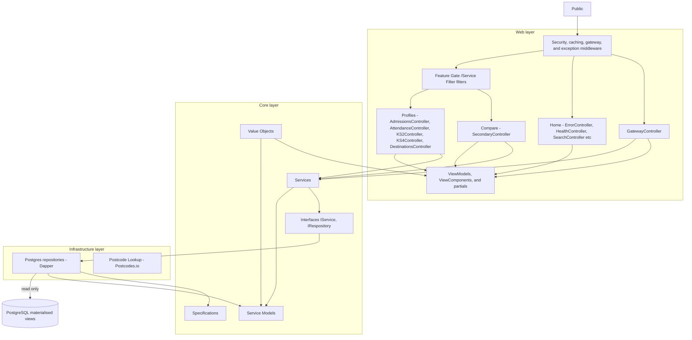
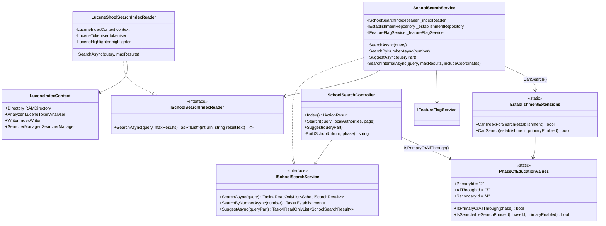
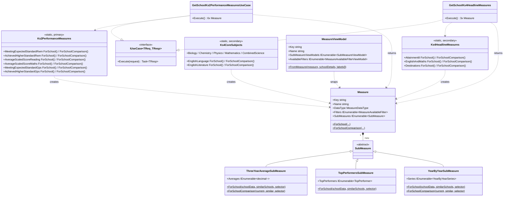

# SAP Public - Low-Level Design (LLD)

* **Repository:** `DFE-Digital/sap-public`
* **Original source** https://github.com/DFE-Digital/sap-sector/blob/main/docs/architecture/low-level-design.md
* **Source author:** Hari Dupati
* **Updates from:** Dan Murfitt
* **Last updated:** 2026-09-09

---

## Contents

1. [Purpose and scope](#1-purpose-and-scope)
2. [Route map](#2-route-map)
3. [Search and phase routing](#3-search-and-phase-routing)
4. [Feature flag behaviour](#4-feature-flag-behaviour)
5. [Request flows](#5-request-flows)
6. [C4 Level 3, component view](#6-c4-level-3-component-view)
7. [Controllers](#7-controllers)
8. [Measure components and ViewModels](#8-measure-components-and-viewmodels)
9. [Use cases and business rules](#9-use-cases-and-business-rules)
10. [Performance measures domain model](#10-performance-measures-domain-model)
11. [Repositories and data sources](#11-repositories-and-data-sources)
12. [Error handling](#12-error-handling)
13. [School layout and side navigation](#13-school-layout-and-side-navigation)
14. [Data pipeline dependency](#14-data-pipeline-dependency)
15. [Test coverage](#15-test-coverage)
16. [Phase comparison and refactoring notes](#16-phase-comparison-and-refactoring-notes)
17. [Class diagrams](#17-class-diagrams)

---

## 1. Purpose and scope

This document covers the low-level design of the SAP Public service. It describes the layered architecture, the search pipeline, middleware, error handling and testing patterns.

For the system boundary, data flows and C4 levels 1 and 2, see the [High-Level Design](./002-high-level-design.md).

---

## 2. Route map

### Profiles

| Page | Sub-page | Filter | Root | URL |
|------|----------|--------|------|-----|
| Overview |  |  | /school/$urn/$school-name | /overview |
| About the school |  |  | /school/$urn/$school-name | /about |
| Admissions |  |  | /school/$urn/$school-name | /admissions |
|  | Primary |  | /school/$urn/$school-name | /admissions/primary |
|  | Secondary |  | /school/$urn/$school-name | /admissions/secondary |
| Curriculum and extra-curricular activities |  |  | /school/$urn/$school-name | /curriculum |
|  | Primary |  | /school/$urn/$school-name | /curriculum/primary |
|  | Secondary |  | /school/$urn/$school-name | /curriculum/secondary |
| Attendance |  |  | /school/$urn/$school-name | /attendance |
| Primary academic performance |  |  | /school/$urn/$school-name | /primary-performance |
|  | Pupil Progress |  | /school/$urn/$school-name | /primary-performance/pupil-progress |
|  |  | Current | /school/$urn/$school-name | /primary-performance/pupil-progress/current |
|  |  | Previous | /school/$urn/$school-name | /primary-performance/pupil-progress/previous |
|  |  | Previous2 | /school/$urn/$school-name | /primary-performance/pupil-progress/previous2 |
|  | Meeting or exceeding standards |  | /school/$urn/$school-name | /primary-performance/meeting-or-exceeding-standards |
|  | Subject scaled scores |  | /school/$urn/$school-name | /primary-performance/subject-scaled-scores |
|  | Additional measures |  | /school/$urn/$school-name | /primary-performance/additional-measures |
| Secondary academic performance |  |  | /school/$urn/$school-name | /secondary-performance |
|  | Progress and attainment |  | /school/$urn/$school-name | /secondary-performance/progress-attainment |
|  |  | Current | /school/$urn/$school-name | /secondary-performance/progress-attainment/current |
|  |  | Previous | /school/$urn/$school-name | /secondary-performance/progress-attainment/previous |
|  |  | Previous2 | /school/$urn/$school-name | /secondary-performance/progress-attainment/previous2 |
|  | English and maths results |  | /school/$urn/$school-name | /secondary-performance/english-and-maths |
|  |  | Grade7 | /school/$urn/$school-name | /secondary-performance/english-and-maths/grade-7-and-above |
|  |  | Grade5 | /school/$urn/$school-name | /secondary-performance/english-and-maths/grade-5-and-above |
|  |  | Grade4 | /school/$urn/$school-name | /secondary-performance/english-and-maths/grade-4-and-above |
|  | Subject entered |  | /school/$urn/$school-name | /secondary-performance/subjects-entered |
|  | Additional measures |  | /school/$urn/$school-name | /secondary-performance/additional-measures |
| 16-19 academic performance |  |  | /school/$urn/$school-name | /16-to-19-performance |
|  | Advanced level qualifications (level 3) |  | /school/$urn/$school-name | /16-to-19-performance/level-3-qualifications |
|  |  | Alevel | /school/$urn/$school-name | /16-to-19-performance/level-3-qualifications/alevel |
|  |  | Academic | /school/$urn/$school-name | /16-to-19-performance/level-3-qualifications/academic |
|  |  | AppliedGeneral | /school/$urn/$school-name | /16-to-19-performance/level-3-qualifications/appliedgeneral |
|  |  | TechLevel | /school/$urn/$school-name | /16-to-19-performance/level-3-qualifications/techlevel |
|  |  | Apprenticeships | /school/$urn/$school-name | /16-to-19-performance/level-3-qualifications/apprenticeship |
|  | Intermediate level qualifications (level 2) |  | /school/$urn/$school-name | /16-to-19-performance/level-2-qualifications |
|  |  | TechCertificates | /school/$urn/$school-name | /16-to-19-performance/level-2-qualifications/techcert |
|  |  | Apprenticeships | /school/$urn/$school-name | /16-to-19-performance/level-2-qualifications/apprenticeship |
|  | English and maths |  | /school/$urn/$school-name | /16-to-19-performance/english-and-maths |
|  | Subject entered |  | /school/$urn/$school-name | /16-to-19-performance/subjects-entered |
|  |  | Allqualifications | /school/$urn/$school-name | /16-to-19-performance/subjects-entered/allqualifications |
|  |  | Academicqualifications | /school/$urn/$school-name | /16-to-19-performance/subjects-entered/academicqualifications |
|  |  | Vocationalandtechnicalqualifications | /school/$urn/$school-name | /16-to-19-performance/subjects-entered/vocationalandtechnicalqualifications |
| Destinations |  |  | /school/$urn/$school-name | /destinations |
|  | Secondary |  | /school/$urn/$school-name | /destinations/secondary |
|  | Education, apprenticeships or work (2023 leavers) |  | /school/$urn/$school-name | /destinations/16-to-19 |
|  | Higher-level study (2022 leavers) |  | /school/$urn/$school-name | /destinations/16-to-19-higher-level-study |
| Search |  |  |  | /search |
|  | Results |  |  | /search/results |

### Comparison

| Page | Sub-page | Filter | Root | URL |
|------|----------|--------|------|-----|
| Compare secondary | About your schools |  | /compare/secondary/ | /about-your-schools |
|  | Academic performance - Pupil attainment |  | /compare/secondary/ | /pupil-attainment |
|  | Academic performance - English and Maths results |  | /compare/secondary/ | /english-and-maths-results |
|  | Destinations after year 11 |  | /compare/secondary/ | /destinations-after-year-11 |
|  | Next steps |  | /compare/secondary/ | /next-steps |

---

## 3. Search

Searching is performed in the `SchoolSearchService` with the following summary:

*	Purpose: Orchestrates a search for schools based on a user query (name, location/postcode, distance, page, (filter) phase, (filter) establishment type) and returns a paged, typed result (SchoolSearchResultsServiceModel).
*	Dependencies: ISchoolSearchIndexReader (search index access) and IPostcodeLookupService (geocoding/postcode-to-latlong).
*	Main flow (SearchAsync):
*	Normalize page number (default 1).
*	If a location/postcode is provided, validate it against a UK postcode regex.
*	If validation fails, return an empty paged response with Status = InvalidPostcode.
*	If postcode is valid, call postcodeLookupService.GetLatitudeAndLongitudeAsync (wrapper around Postcodes.io service).
*	If postcode lookup returns an error, return an empty paged response with Status mapped to PostcodeNotFound or PostcodeServiceError.
*	Otherwise extract latitude/longitude for geospatial search.
*	Build a SearchQuery object (name, latitude/longitude, distance, page, page size).
*	Call schoolSearchIndexReader.SearchAsync with the query.
*	Map index results to SchoolSearchResultServiceModel (via ToSchoolSearchResult extension) and build a PagedResponse with Pager info and Status = Success.
*	Pagination: uses Constants.PageSize and a Pager object to construct pager metadata; page number is controlled by query.PageNumber.
*	Error handling/statuses: returns explicit statuses (InvalidPostcode, PostcodeNotFound, PostcodeServiceError, Success) to let callers distinguish failure modes.
*	Implementation details: fully asynchronous, relies on mapping extension methods and service models (SearchQuery, PagedResponse, Pager, result DTOs).

In the SapData project, we calculate if an establishment has a KS2, KS4, and/or KS5 component, and report these back upon table instantiation.


---

## 5. Feature flag behaviour

The flags are currently `Enable16to19` and `EnablePrimary`, managed through `Microsoft.FeatureManagement`. Secondary has no equivalent flag.

| Component                                           | When flag is off                     |
| --------------------------------------------------- | ------------------------------------ |
| `[FeatureGate("$flag")]` on any controller method | HTTP 404 method
| `_featureManager.IsEnabledAsync(Constants.Constants.$flag$)`                 | Phase is removed in search results |

These flags will be removed as we progress towards go-live as they were intended to filter out areas of the website not yet public (for private beta audiences).

---

## 6. Request flows

### 6.1 KS2 performance page

This traces `GET school/{urn}/{schoolName}/primary-performance/meeting-or-exceeding-standards`, which is the an example flow for the application architecture.

```
[Area(Profiles)]          → MVC Area management
[FeatureGate(Constants.Constants.EnablePrimary)]      → flag on? proceed | off → 404
[ServiceFilter(typeof(PrimaryQueryValidationFilter))]      → Does the URN have a KS2 component? -> Allow through, and pass EstablishmentMinimum model to Controller
                          → If not -> 404

KS2Controller.AcademicPerformanceMeetingOrExceedingStandards(urn)
  └─ [FromServices] IKS2MeetingOrExceedingStandardsService
  └─ urn (string)
  └─ schoolName (string)
  └─ GetMeetingOrExceedingStandardsPercentages(urn, Establishment.LAId))
       └─ IKS2PerformanceRepository
            ├─ GetEstablishmentPerformanceAsync(urn)
                └─ IGenericRepository<type>.ReadAsync(urn)
                │    → v_establishment_ks2_attainment
            ├─ GetLaPerformanceAsync(urn)
                └─ IGenericRepository<type>.ReadAsync(urn)
                │    → v_la_ks2_attainment
            ├─ GetEnglandPerformanceAsync(urn)
                └─ IGenericRepository<type>.ReadAsync(urn)
                │    → v_england_ks2_attainment
       └─ new KS2MeetingOrExceedingStandardsModel (mapping)
            → 7x helper methods (each containing ThreeYearAverage in the form RelativeYearValues<CodedDouble>)
            → 20x property maps
  └─ AcademicPerformanceMeetingOrExceedingStandardsViewModel { EstablishmentMinimumServiceModel, KS2MeetingOrExceedingStandardsModel }
  └─ View("AcademicPerformanceMeetingOrExceedingStandards")
       → renders VerticalNavigation (shared component)
       →  2 x ChartWithTableToggle (partial)
       →  5 x _MeetingExceedingStandardsTable (partial)
       →  1 x _LowMediumHighPriorAttainers (partial)
       → renders SchoolProfilePagination (shared component)
```

Other journeys are similar, or will be being moved into this pattern. 

### 6.2 Other journeys (ToDo)

The remaining journeys named in the HLD are covered elsewhere in this document rather than repeated as traces:

| Journey                          | Where it is described                                   |
| -------------------------------- | -------------------------------------------------------- |
| Search schools                   | Section 4, and the class diagram in section 18.1         |
| View school details              | Section 8, `SchoolDetails` actions                       |
| Compare schools                  | Section 8, comparison controllers, and section 10        |
| Similar schools                  | Section 10, `FindPrimarySimilarSchoolsUseCase`           |
| Authentication and access        | Section 3                                                |
| Operational health and deployment | Section 15, and the workflow files listed in the HLD    |

---

## 7. C4 Level 3, component view

This is the component view of the web application. The container view sits in the HLD.



*Figure 1. C4 level 3, components inside the web application.*

The layering matters here. Controllers never talk to a repository directly. Services depend on interfaces defined in Core, and Infrastructure supplies the implementations. That is what keeps Postgres out of the business logic.

---

## 8. Controllers

Both phases use the same structural approach: `[Authorize]`, `[RequireSchoolPhase]`, use-case injection, `PopulateViewData()` or `SetSchoolViewData()`, and `MeasureViewModel` mapping.

### Primary `SchoolController`, `[Route("school/primary/{urn}")]`

Additional filters: `[RequireFeatureFlag(FeatureFlags.EnablePrimarySchools)]` and `[RequireSchoolPhase(ExpectedSchoolPhase.Primary)]`.

| Action                   | Route suffix                | Returns                                            |
| ------------------------ | --------------------------- | -------------------------------------------------- |
| `Index`                  | *(none)*                    | `SchoolInfoViewModel`                              |
| `Ks2PerformanceMeasures` | `/ks2`                      | `Ks2MeasuresPageViewModel` (6x `MeasureViewModel`) |
| `Attendance`             | `/attendance`               | `AttendanceMeasuresPageViewModel`                  |
| `ViewSimilarSchools`     | `/view-similar-schools`     | `PrimarySimilarSchoolsPageViewModel`               |
| `SchoolDetails`          | `/school-details`           | via `IRequestSchoolAccessor`                       |
| `WhatIsASimilarSchool`   | `/what-is-a-similar-school` | `SchoolInfoViewModel`                              |

### Secondary `SchoolController`, `[Route("school/secondary/{urn}")]`

Filter: `[RequireSchoolPhase(ExpectedSchoolPhase.Secondary)]`. No feature flag filter.

| Action                    | Route suffix                  | Returns                                      |
| ------------------------- | ----------------------------- | -------------------------------------------- |
| `Index`                   | *(none)*                      | `SchoolDetails` via `IRequestSchoolAccessor` |
| `Ks4HeadlineMeasures`     | `/ks4-headline-measures`      | `Ks4HeadlineMeasuresPageViewModel`           |
| `Ks4HeadlineMeasuresData` | `/ks4-headline-measures/data` | JSON, legacy                                 |
| `Ks4CoreSubjects`         | `/ks4-core-subjects`          | `Ks4CoreSubjectsPageViewModel`               |
| `Ks4CoreSubjectsData`     | `/ks4-core-subjects/data`     | JSON, legacy                                 |
| `Attendance`              | `/attendance`                 | `SchoolAttendancePageViewModel`              |
| `AttendanceData`          | `/attendance-data`            | JSON, legacy                                 |
| `SchoolDetails`           | `/school-details`             | via `IRequestSchoolAccessor`                 |
| `WhatIsASimilarSchool`    | `/what-is-a-similar-school`   | via `IRequestSchoolAccessor`                 |

### Comparison controllers

Both phases have a `SimilarSchoolsComparisonController`. Primary applies `[RequireSchoolPhase]` to both `urn` and `similarSchoolUrn`. Secondary applies it to the current school only.

|                  | Primary                                                   | Secondary                                                                   |
| ---------------- | --------------------------------------------------------- | --------------------------------------------------------------------------- |
| Base route       | `/school/primary/{urn}/view-similar-schools/{similarUrn}` | `/school/secondary/{urn}/view-similar-schools/{similarUrn}`                 |
| Comparison pages | Similarity, KS2, Attendance, SchoolDetails                | Similarity, KS4HeadlineMeasures, KS4CoreSubjects, Attendance, SchoolDetails |
| Measure pattern  | Fully implemented                                         | Being adopted, legacy bespoke fields still in places                        |

---

## 9. Measure components and ViewModels

A unified component model. It is fully in place for primary, and in place for the secondary school pages. The secondary comparison pages are still being brought across. All new measure work should follow this pattern.

### The `Measure` domain type

```
public record Measure(
    string Key,
    string Name,
    MeasureDataType DataType,
    IEnumerable<MeasureAvailableFilter> Filters,
    IEnumerable<SubMeasure> SubMeasures);
```

Constructed through:

- `Measure.ForSchool(...)` for the school page, comparing against similar schools average, LA and England
- `Measure.ForSchoolComparison(...)` for the comparison page, comparing two schools side by side

SubMeasure types:

| Type                         | Content                                           | Included in                                |
| ---------------------------- | ------------------------------------------------- | ------------------------------------------ |
| `ThreeYearAverageSubMeasure` | `IEnumerable<decimal?>`, one value per comparator | Both `ForSchool` and `ForSchoolComparison` |
| `TopPerformersSubMeasure`    | Top 3 schools by three-year average               | `ForSchool` only                           |
| `YearByYearSubMeasure`       | Current, Previous and Previous2 series per comparator | Both                                    |

`SchoolData` is the input record that bundles everything a measure needs:

```
internal sealed record SchoolData(
    string Urn,
    string Name,
    Ks4PerformanceData? PerformanceData,
    Ks4DestinationsData? DestinationsData);
```

For primary, `Ks2PerformanceData` is used through `MeasureFieldSelector<Ks2PerformanceData>` in the same way.

### `MeasureViewModel`

Wraps a `Measure` for the view layer. Used by both phases.

```
MeasureViewModel.FromMeasure(measure, schoolDetails, labels[])
```

Labels come from the controller, for example `["School name", "Similar schools average", "Local authority schools average", "Schools in England average"]`.

### View components (partials)

| Partial                         | Purpose                                                      |
| ------------------------------- | ------------------------------------------------------------ |
| `_Measure`                      | Renders a complete measure with all its sub-measures as tabs |
| `_MeasureFilters`               | Renders filter dropdowns for a measure dynamically           |
| `_MeasureThreeYearAverageChart` | Bar chart for the three-year average sub-measure             |
| `_MeasureTopPerformers`         | Top performers panel                                         |
| `_MeasureYearByYearChart`       | Year-by-year line chart                                      |
| `_MeasureTable`                 | Data table view                                              |

### `<tabbed-view>` tag helper

`TabbedViewTagHelper` and `TabbedContentTagHelper` produce GOV.UK tabs markup from Razor without repeating the tab list and panel structure:

```
<tabbed-view html-prefix="attainment8">
  <tab-content id="chart" name="Three year average">...</tab-content>
  <tab-content id="top-performers" name="Top performers">...</tab-content>
  <tab-content id="year-by-year" name="Year by year">...</tab-content>
</tabbed-view>
```

### JavaScript modules

| Module                     | Purpose                                                                                                                       |
| -------------------------- | ----------------------------------------------------------------------------------------------------------------------------- |
| `chart-factory.js`         | ES module with `init(element)` and `initAll()`. `init` scopes chart setup to a DOM subtree for partial refreshes              |
| `measure-filters.js`       | Intercepts filter `<select>` changes, fetches the updated partial over AJAX, swaps the measure section, then re-initialises charts and tabs |
| `mobile-collapsed-tabs.js` | Extends GOV.UK `Tabs`. Always renders collapsed on mobile, and adds `selectTabById()` to restore tab state after a partial refresh |

---

## 10. Use cases and business rules

All use cases implement `IUseCase<TRequest, TResponse>` with `Execute(TRequest)` returning `Task<TResponse>`.

`GetSchoolInfoUseCase` is used on every page in both phases and fetches school info from `v_establishment`.

### Primary use cases (`SAPSec.Core/Features/Primary/`)

`GetSchoolKs2PerformanceMeasuresUseCase`

- fetches the similar schools group, then KS2 performance for all those schools
- applies `FilterBy` case-insensitively, for example the subject filter
- returns 6 `Measure` objects through `Ks2PerformanceMeasures.*.ForSchool()`

`GetSchoolKs2PerformanceComparisonUseCase`

- fetches only the two schools, with no group lookup
- returns 6 `Measure` objects through `Ks2PerformanceMeasures.*.ForSchoolComparison()`

`GetSchoolAttendanceMeasuresUseCase` returns one `Measure`, either overall or persistent absence.

`FindPrimarySimilarSchoolsUseCase`

- loads the group and its characteristic values
- applies `SimilarSchoolsFilters`: location, region, urban or rural, school type, admissions, gender, nursery, resourced provision, sixth form, attendance and school characteristics
- validates filters, returning `ValidationErrors` but still rendering the page rather than an error
- sorts by the chosen KS2 metric, default `RwmExpected`, tie-breaking on display value then alphabetically
- paginates to `ResultsPerPage`, default 10, and returns the full result set separately for the map

Sort options: `RwmExpected` (default), `RwmHigher`, `ReadingScaledScore`, `MathsScaledScore`, `GpsExpected`, `GpsHigher`.

`GetPrimarySimilarSchoolDetailsUseCase` coordinates both schools and pulls GIAS detail for the similar school.

### Secondary use cases (`SAPSec.Core/Features/Secondary/` and `SAPSec.Core/Features/`)

`GetSchoolKs4HeadlineMeasures` returns KS4 performance covering Attainment 8, English and Maths, and Destinations, as `Measure` objects.

`GetSchoolKs4CoreSubjects` returns 7 subjects (English Language, English Literature, Biology, Chemistry, Physics, Maths, Combined Science) with a grade filter of 4, 5 or 7, as `IReadOnlyCollection<Measure>`.

`GetFilteredSchoolKs4CoreSubject` serves the legacy `/data` JSON endpoints.

`FindSimilarSchools` handles secondary similar schools. It does not implement `IUseCase<T,R>` and uses inline LINQ rather than data providers. It will be refactored to match `FindPrimarySimilarSchoolsUseCase`.

`GetSchoolComparisonKs4HeadlineMeasures` serves the comparison page and returns a `Measure`-based response.

`GetSchoolComparisonKs4CoreSubjects` serves the comparison page and returns `IReadOnlyCollection<Measure>`.

`GetAttendanceMeasures` is shared across both phases and returns the attendance series and top performers.

---

## 11. Performance measures domain model

### Primary, KS2 (`SAPSec.Core/Features/Primary/Ks2PerformanceMeasures.cs`)

Six static inner classes, each with `ForSchool()` and `ForSchoolComparison()`. They use `MeasureFieldSelector<Ks2PerformanceData>` selecting Current, Previous and Previous2 across Establishment, LA and England.

| Measure                      | Data type         | Subject filter                       |
| ---------------------------- | ----------------- | ------------------------------------ |
| `MeetingExpectedStandardRwm` | `GradePercentage` | Yes, Reading, Writing, Maths, Combined |
| `AchievedHigherStandardRwm`  | `GradePercentage` | Yes, Reading, Writing, Maths, Combined |
| `AverageScaledScoreReading`  | `ScaledScore`     | No                                   |
| `AverageScaledScoreMaths`    | `ScaledScore`     | No                                   |
| `MeetingExpectedStandardGps` | `GradePercentage` | No                                   |
| `AchievedHigherStandardGps`  | `GradePercentage` | No                                   |

### Secondary, KS4 (`SAPSec.Core/Features/Measures/`)

KS4 measures use the same `Measure.ForSchool()` and `ForSchoolComparison()` factories, through `SAPSec.Core/Features/Measures/Ks4HeadlineMeasures.cs` and `Ks4CoreSubjects.cs`.

| Namespace             | Measures                                                                                                                                  |
| --------------------- | ----------------------------------------------------------------------------------------------------------------------------------------- |
| `Ks4HeadlineMeasures` | `Attainment8`, `EnglishAndMaths` (grade 4 or 5 filter), `Destinations` (all, education or employment filter)                              |
| `Ks4CoreSubjects`     | `EnglishLanguage`, `EnglishLiterature`, `Biology`, `Chemistry`, `Physics`, `Mathematics`, `CombinedScience`, all with a grade 4, 5 or 7 filter |

`MeasureHelper`, which replaces `Ks4HeadlineMeasuresCalculator`, provides the shared `AverageFrom()`, `SeriesFrom()` and `ParseNullableDecimal()`.

---

## 12. Repositories and data sources

### Phase-specific

| Repository                                  | Interface                            | Views or source                                                                                 | Phase     |
| ------------------------------------------- | ------------------------------------ | ----------------------------------------------------------------------------------------------- | --------- |
| `PostgresSimilarSchoolsPrimaryRepository`   | `ISimilarSchoolsPrimaryRepository`   | `v_similar_schools_primary_groups`, `v_similar_schools_primary_values`                          | Primary   |
| `PostgresSimilarSchoolsSecondaryRepository` | `ISimilarSchoolsSecondaryRepository` | `v_similar_schools_secondary_groups`, `v_similar_schools_secondary_values`                      | Secondary |
| `JsonKs2PerformanceRepository`              | `IKs2PerformanceRepository`          | JSON files: `establishment_performance.json`, `la_performance.json`, `england_performance.json` | Primary, interim |
| `PostgresKs4PerformanceRepository`          | `IKs4PerformanceRepository`          | `v_establishment_performance`, `v_la_performance`, `v_england_performance`                      | Secondary |
| `PostgresKs4DestinationsRepository`         | `IKs4DestinationsRepository`         | `v_establishment_destinations`, `v_la_destinations`, `v_england_destinations`                   | Secondary |

KS2 performance is the one place that does not read from PostgreSQL. It is served from JSON files for now, and will move onto database views in the same way as KS4. See section 15.

### Shared across both phases

`PostgresEstablishmentRepository` reading `v_establishment`, `PostgresAbsenceRepository`, `ISchoolDetailsService` and `PostgresEstablishmentEmailRepository`.

### How the DTOs are generated

The DTOs are not written by hand. The chain is:

1. the `SAPData` project generates the SQL scripts
2. running `run-all.sql` against a local PostgreSQL database builds the views and writes out a JSON file per view
3. `SAPSec.DtoGenerator` reads those JSON files and generates the C# DTOs

The JSON files are produced anyway, because the automated tests use them as fixtures. Generating the DTOs from files that already exist is simpler than connecting to the database and reading catalogue metadata to do the same thing.

This replaced an earlier approach where the JSON files and the DTOs were kept in step with the views by hand, which was error-prone.

Two things to know when working on this:

- **The generator has to be run at the right time.** If a view changes and nobody reruns `SAPSec.DtoGenerator`, the DTOs drift from the database and nothing warns you. This is the main weakness of the approach. It is comparable to remembering to regenerate EF models, except EF can warn when its models no longer match the local database.
- **These JSON files are not a runtime data source.** They exist for DTO generation and tests. The exception is KS2 performance, covered in section 15.

---

## 13. Error handling

`NotFoundException` thrown by any use case is caught by `NotFoundExceptionHandler`, registered through `services.AddExceptionHandler<NotFoundExceptionHandler>()`:

- logs a warning
- sets HTTP 404 and rewrites the path to `/error/404`
- outside production, surfaces `ex.Message` for debugging

`ErrorController` sits at `[Route("error")]` with `[AllowAnonymous]`. 401 and 403 render `AccessDenied.cshtml`, 404 renders `NotFound.cshtml`, and anything else renders `Problem.cshtml`.

Middleware pipeline order, relevant excerpt:

```
UseStatusCodePagesWithReExecute("/error/{0}")
UseDeveloperExceptionPage | UseExceptionHandler  ← triggers NotFoundExceptionHandler
UseMiddleware<SecurityHeadersMiddleware>
UseAuthentication / UseAuthorization
MapControllers
```

---

## 14. School layout and side navigation

Both phases call a `SetSchoolViewData()` or `PopulateViewData()` helper on every action. It sets `ViewData["SchoolNavigation"]` using phase-specific factories:

- `SchoolSideNavigationViewModel.CreatePrimary(Url, urn, actionName)` gives Overview, KS2, Attendance, View similar schools, School details
- `SchoolSideNavigationViewModel.CreateSecondary(Url, urn, actionName)` gives Overview, KS4 Headline Measures, KS4 Core Subjects, Attendance, View similar schools, School details

Comparison layouts in both phases read `ViewData["ComparisonSchool"]` to render the comparison header and sub-navigation.

---

## 15. Data pipeline dependency

Most data is read live from PostgreSQL on each request. KS2 performance is the exception.

### Packaged into the deployment artefact

The KS2 JSON files (`establishment_performance.json`, `la_performance.json`, `england_performance.json`) are generated by SAPData and shipped with the build. Updated KS2 data therefore needs a redeploy to take effect.

This is deliberate for now rather than a permanent design. KS2 will move onto PostgreSQL views in the same way as KS4, at which point the redeploy dependency goes away.

### Read live from PostgreSQL

- `v_similar_schools_primary_groups` and `v_similar_schools_primary_values`, primary similar schools
- `v_similar_schools_secondary_groups` and `v_similar_schools_secondary_values`, secondary similar schools
- `v_establishment_performance`, `v_la_performance`, `v_england_performance`, KS4 performance
- `v_establishment_destinations`, `v_la_destinations`, `v_england_destinations`, KS4 destinations
- `v_establishment`, all school info

---

## 16. Test coverage

| Project                                 | Scope                                                                                                                                                                                                    |
| --------------------------------------- | -------------------------------------------------------------------------------------------------------------------------------------------------------------------------------------------------------- |
| `Tests/SAPSec.Core.Tests`               | Unit. All KS2 measures (6 measures, all filter variations), `FindPrimarySimilarSchoolsUseCase` (all sort keys, tie-breaking, pagination, filter validation, `NotFoundException`), KS4 headline and core subject use cases, `EstablishmentExtensions.CanSearch`, `SchoolSearchService` phase and flag behaviour |
| `Tests/SAPSec.Web.Tests`                | Unit. Controllers (primary redirect, feature flag off), `NotFoundExceptionHandler` (404 with warning log, 500 with error log)                                                                            |
| `Tests/SAPSec.Infrastructure.Tests`     | Unit. Lucene abbreviation expansion (`St` to `Saint`), multi-token search, prefix matching                                                                                                               |
| `Tests/SAPSec.Test.InMemoryIntegration` | Integration with in-memory repositories and no database. All primary and secondary routes return 200, feature flag off gives 404 for primary, KS2 and KS4 measures with correct table data and filter behaviour, similar schools filter, sort and pagination, comparison measures and accessibility assertions |
| `Tests/SAPSec.Test.EndToEnd`            | Playwright. Full user journeys, search through school detail through comparison, for both phases                                                                                                         |
| `Tests/SAPSec.Test.Accessibility`       | Playwright with axe-core, WCAG 2.1 AA. All pages in both phases including all comparison sub-pages                                                                                                       |

`SAPSec.Test.InMemoryIntegration` was previously named `SAPSec.Test.Integration`. It uses in-memory repository doubles such as `InMemoryKs2PerformanceRepository`, `InMemorySimilarSchoolsPrimaryRepository` and `InMemoryKs4PerformanceRepository`, and needs no database.

Test builders live in `Tests/SAPSec.Test.Common`:

- `Build.Establishment("urn", "name", x => x.Primary().Open().InLA("001"))` and `.Secondary()`
- `Build.PrimaryGroup(urn, neighbourUrns[])` and `Build.SecondaryGroup(...)`
- `Build.Ks2Performance.Establishment(urn, x => x.WithRwmExpected(current, prev, prev2))`

---

## 17. Phase comparison and refactoring notes

| Aspect                                        | Primary                                                                             | Secondary                                                                                                     |
| --------------------------------------------- | ----------------------------------------------------------------------------------- | -------------------------------------------------------------------------------------------------------------- |
| Performance data source                       | JSON files through `JsonKs2PerformanceRepository`, interim                          | PostgreSQL through `PostgresKs4PerformanceRepository`                                                          |
| Performance data type                         | `Ks2PerformanceData`                                                                | `Ks4PerformanceData`                                                                                           |
| Measure domain classes                        | `Ks2PerformanceMeasures`, 6 measures                                                | `Ks4HeadlineMeasures`, `Ks4CoreSubjects`                                                                       |
| `Measure` and `SubMeasure` pattern            | Fully implemented                                                                   | In place on school pages, comparison pages still being brought across                                          |
| View components (`_Measure`, `<tabbed-view>`) | Fully implemented                                                                   | Being adopted                                                                                                  |
| JSON `/data` endpoints                        | Not used                                                                            | Still routed, legacy, being removed                                                                            |
| Similar schools repository                    | `ISimilarSchoolsPrimaryRepository`                                                  | `ISimilarSchoolsSecondaryRepository`                                                                           |
| Find similar schools use case                 | `FindPrimarySimilarSchoolsUseCase`, implements `IUseCase<T,R>`, uses data providers | `FindSimilarSchools`, does not implement `IUseCase`, inline LINQ, will be refactored to match primary          |
| Feature flag                                  | `EnablePrimarySchools` gates all routes                                             | No equivalent flag                                                                                             |
| Side nav                                      | Overview, KS2, Attendance, Similar schools, School details                          | Overview, KS4 Headline, KS4 Core Subjects, Attendance, Similar schools, School details                         |

Shared across both phases: `GetSchoolInfoUseCase`, `GetAttendanceMeasures`, `IEstablishmentRepository`, `IAbsenceRepository`, `SimilarSchoolsFilters`, `SchoolSearchController` and `SchoolSearchService`, `Measure`, `SubMeasure` and `MeasureViewModel`, `ISimilarSchoolsPageViewModel`, `ISimilarSchoolRowViewModel`, `NotFoundExceptionHandler`, DSI authentication and `SecurityHeadersMiddleware`.

---

## 18. Class diagrams

### 18.1 Search pipeline and phase-aware filtering



---

### 18.2 Measure domain model, both phases

