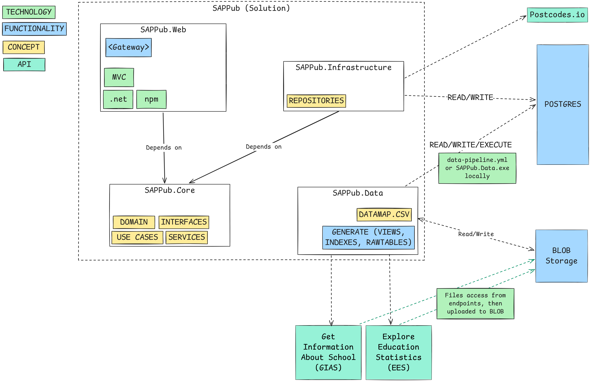
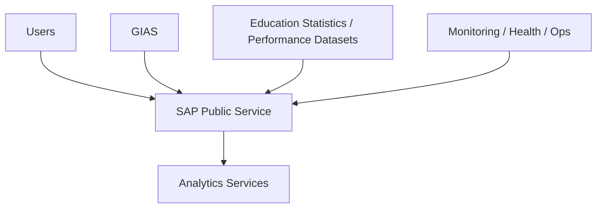
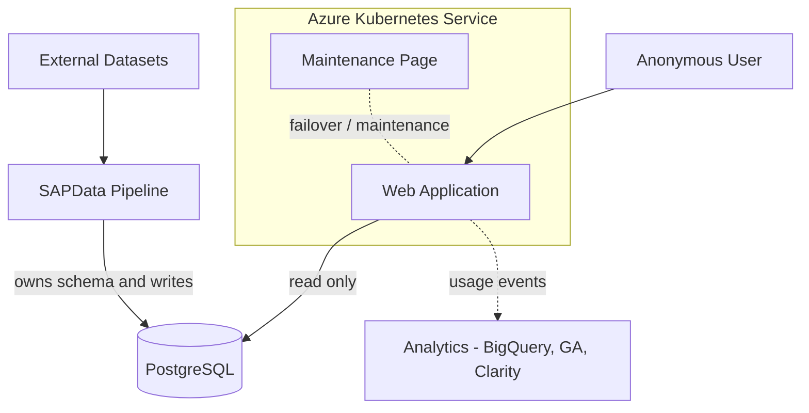
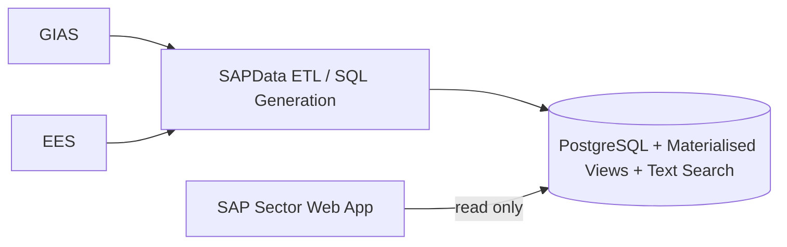

# SAP Public

## High-Level Design (HLD)

**Repository:** `DFE-Digital/sap-public`
**Author:** Manraj Singh Gill
**Last updated:** 2026-09-08

---

## Contents

1. [Purpose](#1-purpose)
2. [Scope](#2-scope)
3. [Service overview](#3-service-overview)
4. [Users and user types](#4-users-and-user-types)
5. [Data and information types](#5-data-and-information-types)
6. [Data flows](#6-data-flows)
7. [High-level architecture diagram](#7-high-level-architecture-diagram)
8. [C4 system diagrams](#8-c4-system-diagrams)
9. [Interactions and key flows](#9-interactions-and-key-flows)
10. [Non-functional considerations](#10-non-functional-considerations)
11. [Assumptions and constraints](#11-assumptions-and-constraints)
12. [References](#12-references)
13. [Glossary](#13-glossary)

---

## 1. Purpose

This document gives an overview of the SAP Public service and the data platform that supports it, both of which live in the `DFE-Digital/sap-public` repository.

It covers:

- the main components and where the system boundary sits
- how users get access
- how data enters the platform, how it is defined, and how it is retrieved
- the operational and technical services the platform needs to run

It stays above the level of code. Anything that describes .NET implementation structure, such as projects, layers, classes or method signatures, is in the [Low-Level Design (LLD)](./low-level-design.md).

The aim is that both technical and non-technical readers can understand the system boundary, the architecture, the data flows and the operational model.

---

## 2. Scope

### In scope

- user types and access patterns
- system components and what each is responsible for, at a logical level
- data ownership, definition and access
- primary data stores
- the search subsystem and where it is heading
- authentication and security boundaries
- high-level interaction flows
- data ingestion and the supporting pipeline
- hosting and operational model
- C4 views at levels 1 and 2

### Out of scope

These are covered in the [LLD](./low-level-design.md) and the [ERD](./entity-relationship-diagram.md):

- application project structure, layers and internal components
- class-level implementation, patterns and API signatures
- C4 level 3 component views
- full database schema, materialised view definitions and the detailed ERD
- Terraform and Kubernetes resource definitions
- CI/CD implementation detail

---

## 3. Service overview

SAP Public is a public-facing school information service.

It lets users:

- search for schools
- view establishment information
- view performance and related statistical information
- compare schools using derived and curated data

The repository holds both the application runtime and the data processing that supports it.

### Logical building blocks

| Building block        | Responsibility                                                                              |
| --------------------- | -------------------------------------------------------------------------------------------- |
| Web application       | Public-facing entry point. Renders search, detail and comparison journeys. Read-only. (Note :- Due to gateway implementation currently application write User Email address to dataabse, this will be removed after Beta stage testing)          |
| Data pipeline         | Acquires, normalises and loads external datasets. Owns and refreshes the database structure.   |
| PostgreSQL            | Authoritative store for curated data, exposed to the application through materialised views.   |
| Full Text Search          | Full text search feature of PostgreSQL is used to supports search journeys. see section 5.3.                |
| AKS                   | Container hosting and deployment.                                                              |

How the web application and the pipeline are structured internally is in the [LLD](./low-level-design.md).

### Architectural summary

- upstream data inputs provide establishment and education-related datasets
- the data pipeline downloads, normalises and prepares that data, and is the only thing that writes to the database
- PostgreSQL is the authoritative data store
- a derived search index supports search journeys
- the web application delivers the user-facing experience and only reads data
- AKS provides hosting and deployment

---

## 4. Users and user types

The main user groups are:

- general public

### Authentication model

No Authenication is requited.

Pleote:- Only to support Beta testing, Gateway page have been developed which allow registered users to access application bases on their email address. This check will be removed before go live and users which registered during beta testing will be removed from system along with their data.

### Operational users

Operational and engineering users interact with the service indirectly, through:

- deployment workflows
- monitoring
- health checks
- logs
- maintenance controls
- data pipeline operations

---

## 5. Data and information types

### 5.1 Data ownership and access model

This section explains how data definition, persistence and retrieval work. The approach is different from most other services in the portfolio, so it is set out here rather than left to the LLD.

The pipeline owns the schema. The application only reads.

| Concern           | Owned by           | Notes                                                                        |
| ----------------- | ------------------ | ---------------------------------------------------------------------------- |
| Schema definition | Data pipeline      | Tables and materialised views are generated deterministically from metadata.  |
| Writes            | Data pipeline      | The application does no inserts, updates or deletes. (Note :- Only due to Gateway on beta application write user email address to system, this will be removed before go Live)                         |
| Reads             | Web application    | Read-only queries issued through Dapper. (Note :- Only due to Gateway page on beta application write user email address to system, this will be removed before go Live)                                     |
| Query surface     | Materialised views | The application queries views, not base tables.                               |

What follows from that:

**There is no ORM and no EF Core code-first model.** The application does not use entity tracking, lazy loading, navigation properties or EF-managed migrations.

**Read models are generated rather than hand-written.** A JSON description of each view's shape is produced, and the read model is generated from that serialised structure. This keeps the model in step with the views the pipeline produces.

**Schema change is a pipeline concern.** A change to the shape of the data is made in the pipeline metadata, which flows through to regenerated SQL, refreshed views and regenerated read models. There is no runtime migration step in the application.

Why it is done this way:

- the workload is read-heavy and read-only, so ORM change tracking adds cost without giving anything back
- pre-shaped materialised views give predictable query performance for detail and comparison pages, which would otherwise need wide multi-table joins
- generating the schema deterministically from metadata makes data refreshes repeatable and auditable
- keeping writes out of the runtime removes a class of runtime failure, and means application deployment does not depend on data refresh

The view definitions, the generated model structure and the query patterns are in the [LLD](./low-level-design.md) and the [ERD](./entity-relationship-diagram.md).

### 5.2 Authoritative application data

Held in PostgreSQL:

- school and establishment metadata
- performance and statistical data
- comparison data
- supporting reference information

### 5.3 Search data and direction of travel

Search is implemented using Full text search feature of PostgreSQL. The index is done part of Data ingestion scripts which produced by PUBSAP.Data executable. Descision to replace Lucense with Text search is recorded in [ADR](../adrs/020-fts-and-geolocation-in-postgres.md). The text searcs suppprts:

- School name text search
- Postcode-based search queries 

### 5.4 Identity and access data

Application don't need any Authentication or Autherization as its available for public to use. (Note:- Only to access Beta using Gateway user required to registerd their email address. This check will be remove before go Live.)

### 5.5 Generated and packaged data files

The repository also holds generated and packaged data assets used at runtime, including the JSON structures that read models are generated from. See section 5.1.

### 5.6 Operational and supporting data

- logs
- health status information
- deployment metadata
- pipeline outputs
- data protection keys for distributed hosting
- usage and behavioural analytics, sent to three separate destinations (see section 6.5)

---

## 6. Data flows

## 6.1 Data pipeline

The supporting data platform sits under `SAPData/`.

The pipeline:

1. acquires raw source files from upstream data sources
2. exits early where nothing has changed
3. cleans and normalises the source data
4. generates SQL from metadata and source structures
5. runs that SQL to create or refresh tables and materialised views

It follows a raw, staging and curated model, with a deterministic SQL generation process.

### Key characteristics

- repeatable
- metadata-driven
- auditable
- SQL-first
- restartable
- suited to running on a schedule

## 6.2 Data flow model

SAP Sector uses several external datasets covering schools, performance, destinations, attendance, inspection outcomes and related education metrics.

These are ingested through the pipeline and transformed into a consistent form before being loaded into PostgreSQL, which is the authoritative store for the service.

Curated data is then shaped into materialised views, which are the query surface for the application. The pipeline's only write target is PostgreSQL; the search index is built separately by the application from that data.

## 6.3 High-level data flow summary

- external datasets are downloaded or supplied to the pipeline
- source files are mapped, cleaned, normalised and transformed
- processed data is loaded into PostgreSQL
- materialised views are built to serve the application's query patterns
- to improve performance indexes on materialised views are created in PostgreSQL
- to support full text text search indexes are created in PostgreSQL
- the web application issues read-only queries against materialised views
- the web application queries use text search for search journeys
- monitoring and operations services watch the running platform
- usage events are emitted to analytics destinations, both server-side and from the browser

## 6.4 Summary table of data sources and logical domains

| Data source             | Data domain                       | Example fields                                          | Stored in                     | Downstream use          | Cadence             |
| ----------------------- | --------------------------------- | ------------------------------------------------------- | ----------------------------- | ----------------------- | ------------------- |
| GIAS                    | Establishment metadata            | URN, address, governance, phase, trust, local authority | PostgreSQL                    | Search, detail pages    | Daily or scheduled  |
| EES                     | Attainment and comparison metrics | Attainment 8, Progress 8, subject measures              | PostgreSQL                    | Detail and comparison   | Periodic            |
| EES                     | Destination outcomes              | education, employment, apprenticeships                  | PostgreSQL                    | Detail and comparison   | Periodic            |
| EES                     | Attendance and absence            | absence %, authorised %, unauthorised %                 | PostgreSQL                    | Detail and comparison   | Periodic            |
| Ofsted                  | Comparative cohorts               | groupings, peer metrics, derived values                 | PostgreSQL, generated assets  | Comparison              | Periodic            |
| Derived search data     | Search index data                 | normalised names, compound lookups, indexed fields      | In-memory index, per replica  | Search                  | Rebuilt at pod start |

## 6.5 Analytics and third-party data flows

Usage data leaves the service through three separate routes. They are listed here because they have different owners, different consent positions and different data protection implications.

| Destination | Direction | What is sent | Consent | Notes |
| --- | --- | --- | --- | --- |
| DfE Analytics to Google BigQuery | Server-side, from the application | Request-level web events, plus custom link-click events posted back from the browser and forwarded by the application | Not consent-gated | `/healthcheck` is excluded. Disabled in local development and in the UITests, IntegrationTests, EndToEndTests and AccessibilityTests environments. A custom event suppresses the corresponding web request event to avoid double counting |
| Google Analytics, via Google Tag Manager | Client-side, from the user's browser | Standard GA page and interaction data | Loaded only when the `cookie_policy` cookie is set to `enabled` | Container ID is environment-specific |
| Microsoft Clarity | Client-side, from the user's browser | Session recording and interaction heatmaps | Loaded only when the `cookie_policy` cookie is set to `enabled`, and initialised with `ad_Storage: denied`, `analytics_Storage: granted` | This is behavioural recording on an authenticated service and should be reflected in the data protection position |

The cookies page documents the cookies each of these sets, and integration tests assert that the Google Tag Manager and Clarity tags are absent when consent has not been given.

---

### ## 7. High-level architecture diagram

The diagram below is the main stakeholder-facing view of the service. It shows the user groups, the authentication boundary, the hosted application, the search and persistence technologies, the supporting services and the data pipeline.

*Figure 1. SAP Public high-level architecture overview.*

### Diagram explanation

At the top are the main public-facing application (SAPPub.Web) which also have list of primary technology stack which used to build this application. Application don't require any Authenication or Authrization, but to support Beta testing currently Gateway page have been put in place which allow user to access by registering with their email address. Gateway page check will be removed when application is ready to release to Live.

SAPPub.Web depends on SAPPub.Core which defined the domain model and business services. SAPPub.Core exposes various Business Services interfaces. SAPPub.Core don't drectly call database instead it use Repositry layer interfaces which are defined in SAPPub.Infrastrcute r. All these depdencies all internal depdencies and code for all these Projects build and deployed as single unit.

SAPPub.Infrastrcute also expose calls to 3rd party APIs using Repositry design ppattern, so application makes call to Postcode.io to prerform postcode lookup.

The runtime application is hosted in Azure Kubernetes Service and is shown as a single web application. How it is layered internally is an implementation concern and is covered in the [LLD](./low-level-design.md).

Right hand side of diagram is PostgreSQL, the authoritative database, queried read-only through materialised views. SAPPub.Infrastrcute uses Dapper (ORM library)) to perform queries. Please note application currently only perform write operation to record User Email address to support Beta testing. 

Down the right-hand side is Azure Blob Storage, which is used to store source files and also output files.

The SAPData (SAPPub.Data) pipeline sits at the bottom. It loads and transforms external sources including GIAS and education statistics, and it owns the database structure. It use Azure blob storage to read DataMap & Source CSV Files and update relevant files.

---

## 8. C4 system diagrams

This section gives C4 views at levels 1 and 2. The level 3 component view is in the [LLD](./low-level-design.md), because it describes implementation structure.

---

## 8.1 C4 Level 1, system context

The context view shows SAP Sector in its wider setting, including users, authentication, upstream data sources and external supporting services.

*Figure 2. C4 level 1, system context.*

### Context explanation

SAP Sector sits in the middle. Users reach it through DfE Sign-in. Upstream education datasets, including Ofsted data which are consumed indirectly, feed the platform through the data pipeline. Monitoring and analytics sit outside the core system boundary but are still operational dependencies.

---

## 8.2 C4 Level 2, container diagram

This breaks the service into its main runtime and supporting containers.

*Figure 3. C4 level 2, container diagram.*

### Container explanation

The containers are:

- the web application, hosted in AKS
- the database, which the application reads and the pipeline writes

- -the data pipeline
- the maintenance page

The direction of the arrows matters here. All writes come from the pipeline, and the application's relationship with both stores is read-only. See section 5.1.

---

## 8.3 High-level data flow diagram

This one focuses on how external data gets into the platform and is then used by the service.

*Figure 4. High-level data flow diagram.*

### Data flow explanation

The service reads from one place: PostgreSQL, through materialised views. That access is read-only. Search is served using full-text search from PostgreSQL that is builds during data pipeline run from the same PostgreSQL data, so it is derived rather than a second source of truth.

---

## 9. Interactions and key flows

These are the journeys and operational flows the service supports. The step-by-step sequences, the responsibilities of each part of the application, and the query detail are in the [LLD](./low-level-design.md).

### 9.1 Search schools

### 9.2 View school details

### 9.3 Compare schools

### 9.4 Similar schools

### 9.5 Application access

### 9.6 Operational health and deployment

---

## 10. Non-functional considerations

### 10.1 Security

-
-  cookie handling
- anti-forgery protections
- Content Security Policy applied
- data protection keys managed for distributed deployments
- the application has no write permissions on the database, which limits what an application-level compromise could do

### 10.2 Performance

- materialised views give pre-shaped, predictable query performance for detail and comparison pages
- the search index handles search workloads efficiently
- separating the layers makes performance tuning easier to target
- frontend assets are built and served in a predictable way

### 10.3 Availability

- the service runs on AKS
- health endpoints allow runtime verification
- review and deployment workflows support controlled release
- the maintenance page covers maintenance and failover
- application availability does not depend on data refresh, because refreshes are driven by the pipeline

### 10.4 Maintainability

- a clear split between the data platform and the runtime service
- schema change is metadata-driven and deterministic
- testing covers unit, integration, UI, end-to-end and accessibility levels

### 10.5 Observability

- structured logging through Serilog and logit.io
- monitoring and health endpoints
- analytics integration for service insight and behaviour tracking, across three destinations (see section 6.5)

The `/healthcheck` endpoint currently reports only that the application is running and that the static content directory is present. It does not test PostgreSQL connectivity or confirm that the search index has been built, so a replica can pass its readiness probe while search is still empty. Extending the health endpoint to cover its dependencies is an open item.

---

## 11. Assumptions and constraints

- PostgreSQL is the authoritative structured data store
- the data pipeline owns the schema and all writes to PostgreSQL, and the application is read-only against it; every Dapper call in the infrastructure layer is a query, with no insert, update or delete path
- the only thing the application writes is its own in-memory search index, which does not survive a restart
- the application queries materialised views rather than base tables, so query patterns are limited to what the views provide
- read models are generated from serialised view structures rather than written by hand
- the service is authenticated throughout
- upstream dataset availability and quality, including Ofsted publication cycles, affect what the service can show
- the repository holds both runtime service code and data pipeline concerns
- refresh cadences vary by dataset rather than being uniform

---

## 12. References

### Architecture documents

- [`docs/architecture/overview.md`](./overview.md)
- [`docs/architecture/low-level-design.md`](./low-level-design.md)
- [`docs/architecture/entity-relationship-diagram.md`](./entity-relationship-diagram.md)
- [`docs/adrs/`](../adrs/)

### Repository documents

- `README.md`
- `SAPData/README.md`
- `maintenance_page/README.md`
- `docs/developers/project-structure.md`
- `docs/developers/authentication.md`
- `docs/developers/search-lucene.md`
- `docs/developers/testing.md`

### Workflow references

- `.github/workflows/build-and-deploy.yml`
- `.github/workflows/data-pipeline.yml`
- `.github/workflows/delete-review-app.yml`
- `.github/workflows/toggle-maintenance-page.yml`

### Other supporting areas

- `terraform/`
- `Tests/`

---

## 13. Glossary

**SAP Public.** The public-facing service described in this document.

**SAPData.** The data ingestion and SQL generation part of the repository. It prepares and loads data for the service and owns the database structure.

**PostgreSQL.** The relational database used as the authoritative data store.

**Materialised view.** A stored, pre-computed result set built by the pipeline. Materialised views are the query surface the application uses, with relationships already resolved.

**Dapper.** The lightweight data access library used to issue read-only queries against materialised views. Used instead of an ORM because the application does not write data or manage schema.

**Search index.** The derived index that supports search journeys. Currently Lucene, with a planned move to PostgreSQL full-text search.

**Gateway.** The gateway page are only in place to support Beta testing.

**ETL.** Extract, transform, load. The process used to acquire, clean, transform and load external data into the platform.

**GIAS.** Get Information About Schools, a government dataset holding school and establishment information.

**Performance datasets.** Education performance and statistical datasets used to enrich the service.

**Similar schools data.** Derived or supplied comparison data that supports peer group and comparison journeys.

**Cadence.** How often a dataset or derived technical asset is refreshed.
