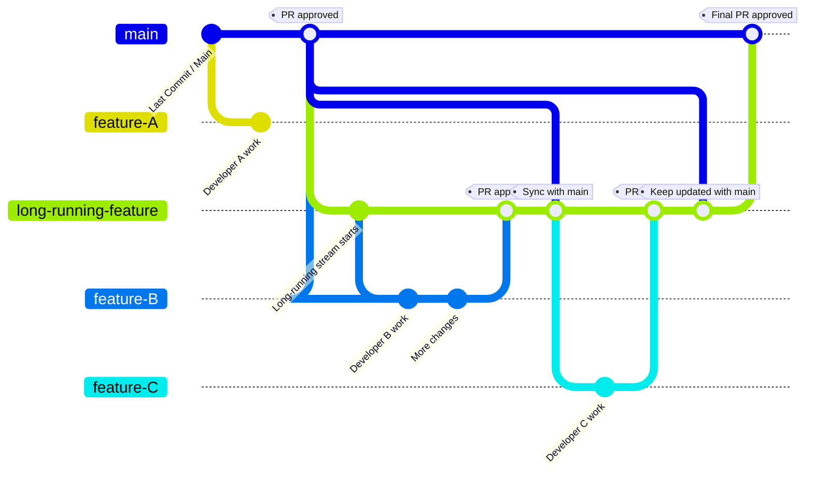
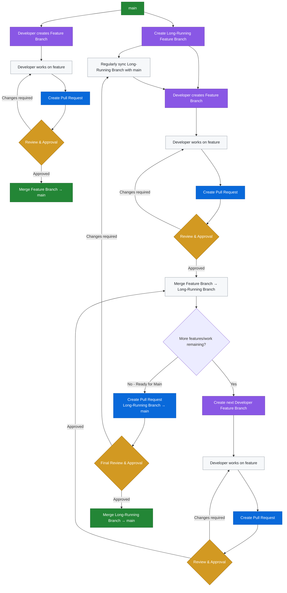

# Branching workflow

This document explain current Standard feature development workflow and also using Long running branch workflow.

1. Standard feature flow — developer branches directly from main and merges back into main using PR process.

2. Long-running feature flow — a long-running branch is created from main; developers branch from it, merge back into it using PR process, and eventually the long-running branch is merged into main using PR Process.

## Simple explanation
### Stream 1 — Normal feature development

This is your existing process.

1. Start from main
    
    - main contains the current approved code.

2. Developer creates a feature branch
    
    > - For example:
    >
    >       main ---> feature/customer-search

3. Developer does their work
    
    - All changes for that feature are made in the feature branch.
    
    - main is not directly changed by the developer.

4. Developer creates a Pull Request
    
    - When the feature is ready, they create a PR:
    
    - feature/customer-search → main

5. Code review takes place
    
    - Other developers/reviewers review the changes.
    
    - If changes are needed, the developer updates the feature branch.
    
    - The PR is reviewed again.

6. PR is approved
    
    - Once the required reviewers approve it, the PR can be merged.

7. Feature branch is merged into main
    
    - The completed feature becomes part of the main codebase.

### Stream 2 — Long-running feature development

This is the new process for work that is too large or takes too long to go directly into main.

- Long running feature branch process only will be used for changes which can't be put behind feature flag and impact running data pipelines and application against old data sets.

1. Create a Long-Running Feature Branch
   
   - Start from main and create something like:
        
    >    main → long-running-feature
    >    
    >    - Think of this branch as a temporary version of main dedicated to a larger piece of work.
    >    
    >    - It may contain multiple features developed by multiple developers.

2. Keep the Long-Running Branch updated
    
    - As other work gets merged into main, the long-running branch should be regularly updated from main.
        
    >    For example:
    >        
    >        main → normal-feature-1
    >        
    >        main → normal-feature-2
    >        
    >        main → long-running-feature
    
    - The long-running branch periodically incorporates the latest changes from main.
    
    - This is important because the long-running branch may exist for weeks or months. Keeping it updated reduces the risk of having a huge number of conflicts when you eventually merge it back into main.

3. Developer creates a branch from the Long-Running Branch

    - Instead of branching from main, developers working on this stream branch from the long-running branch.
        
    >    For example:
    >        main → long-running-feature
    >    
    >               long-running-feature → feature-A
    >                
    >                long-running-feature → feature-B
    >                
    >                long-running-feature → feature-C

    - So a developer working on Feature A creates:
        
        - feature-A from: long-running-feature

4. Developer works on their feature
    
    - The developer makes their changes in their own feature branch.
     
      >  For example:
      >  
      >      long-running-feature → feature-A
      >                             feature-A → commit 1
      >                             feature-A → commit 2
      >                             feature-A → commit 3

    - They can work normally without directly changing the long-running branch.

5. Developer creates a Pull Request
    
    - When their work is ready, they create:
        
    >    - feature-A → long-running-feature
    >    
    >    - Not: feature-A → main
    
    - This is the key difference between the two streams.

6. Review and approval happens
    
    - The team reviews the PR just as they do with the normal process.
    
    >   If changes are required:
    >
    >   - Developer → makes changes → PR reviewed again
    >
    >   If everything is approved:
    >
    >   - feature-A → long-running-feature

    - The feature is merged into the long-running branch.

7. Repeat for other features
    
    - Other developers can independently create branches from the long-running branch:
      
      >  long-running-feature → feature-A
      >
      >  long-running-feature → feature-B
      >
      >  long-running-feature → feature-C
      >
      >  long-running-feature → feature-D

    - Each feature follows the same process:
      
      >  Developer Branch → Developer Work → PR → Code Review → Approval → Merge → Long-Running Branch

    - The long-running branch therefore becomes the integration branch for that stream of work.

8. Continue synchronizing with main
    
    - While developers are working, normal development may continue on main.
      
      >  For example:
      >
      >      main → normal feature
      >
      >      main → bug fix
      >
      >      main → another feature
      >
      >      main → ...
    
    - You should regularly bring those changes into the long-running branch.

      >  Conceptually: (Regular Sync)
      >  
      >  main → long-running-feature
    
    - This means the long-running branch contains:

        - the latest relevant changes from main

        - plus the work being developed for the long-running feature

9. When all work is complete
    
    - Once all the features belonging to the long-running stream are finished, reviewed, and merged into the long-running branch, you have something like:
        
      >  main → long-running-feature
      >
      >                             → feature-A ✓
      >
      >                             → feature-B ✓
      >
      >                             → feature-C ✓
      >                             
      >                             → feature-D ✓

    - At this point, the long-running branch is considered ready to go back to main.

10. Create the final Pull Request
    
    > Now create:
    >
    >   - long-running-feature → main
    >    
    >        - This is a separate PR from the individual feature PRs.
    >    
    >        - The purpose of this final PR is to review the complete set of changes that will be introduced into main.

11. Final review and approval
    
     - The team reviews the final PR.
       
    >    - If problems are found:
    >        
    >        - Long-running branch → Apply Fix / update → Final PR reviewed again
    >    
    >    - If everything is approved:
    >       
    >       - long-running-feature → main
    
    - The entire long-running stream is now integrated into main.