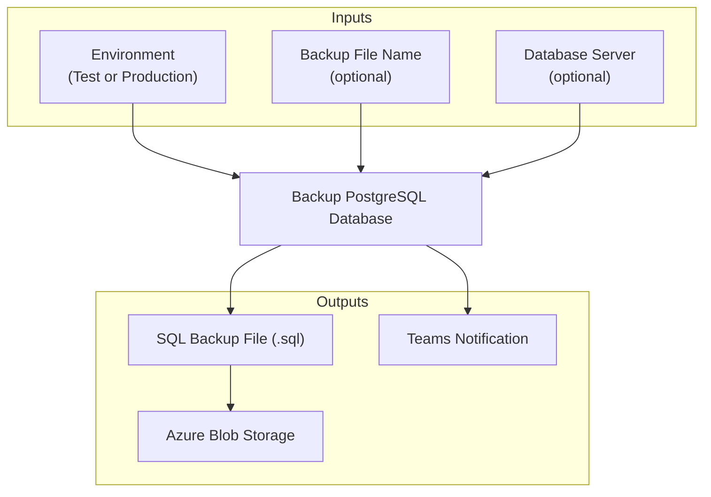

# Database Backup Workflow

## Purpose

Creates a PostgreSQL database backup and stores it in Azure Blob Storage.

## Notes: backup filename

Scheduled backup:
sappub_[env]_YYYY-MM-DD.sql

Manual backup:
sappub_[env]_adhoc_YYYY-MM-DD.sql

Custom backup:
[user-specified-name].sql

