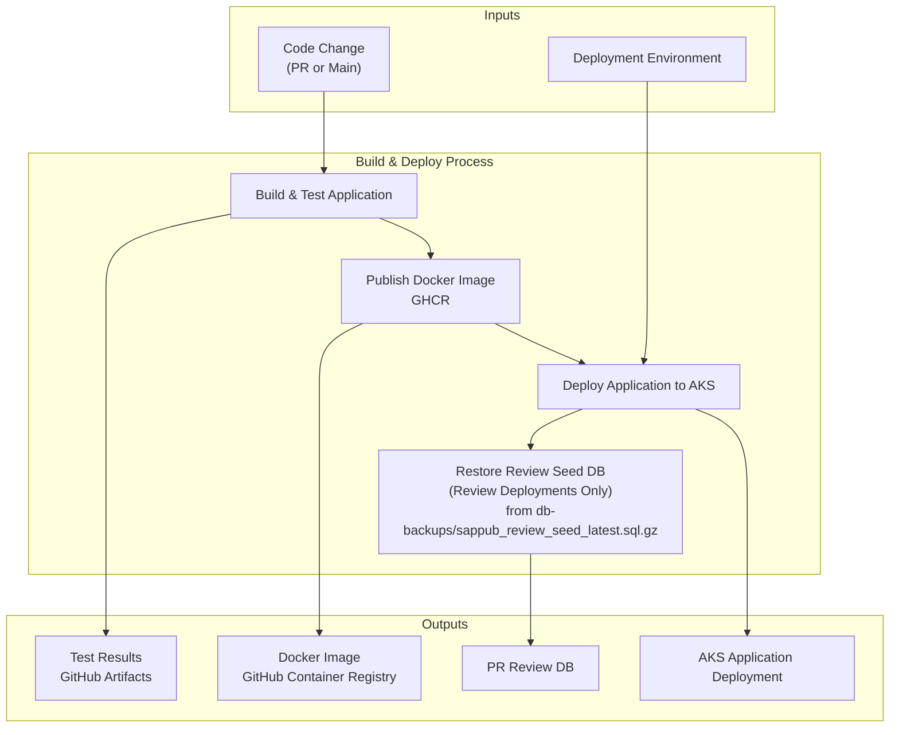
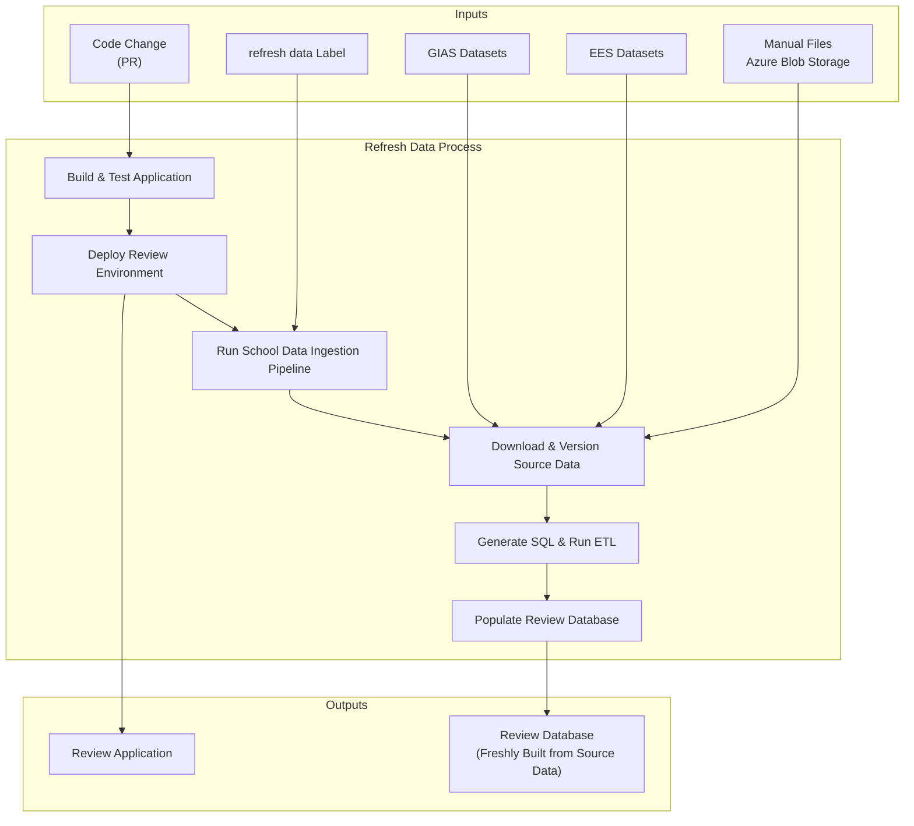

# Build and deploy workflow

The main workflow for building and deploying the application to the specified environment.

PR with 'deploy' label when you want to build a review deployment, 
Push to main branch when you want to deploy to test.
Manual trigger when you want to deploy to production.

# General Flow

# Review Deployment with Refresh Data

When your code change includes changes to the data pipeline and you want to deploy to a review app.
