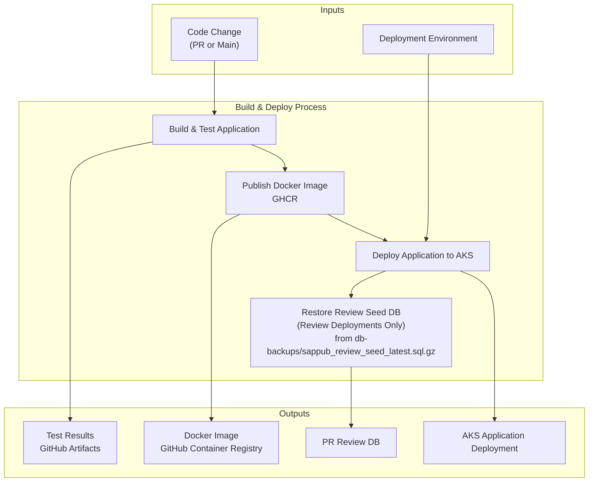

# Build and deploy workflow

# General Flow

```mermaid
flowchart TD

    subgraph Inputs
        A1["Code Change<br/>(PR or Main)"]
        A2["Deployment Environment"]
    end

    subgraph Build & Deploy Process
        B1["Build & Test Application"]
        B2["Publish Docker Image<br/>GHCR"]
        B3["Deploy Application to AKS"]
        B4["Restore Review Seed DB<br/>(Review Deployments Only)</br>from db-backups/sappub_review_seed_latest.sql.gz"]

        B1 --> B2
        B2 --> B3
    end

    subgraph Outputs
        C1["Docker Image<br/>GitHub Container Registry"]
        C2["Test Results<br/>GitHub Artifacts"]
        C3["AKS Application Deployment"]
        C4["PR Review DB"]
    end

    A1 --> B1
    A2 --> B3

    B2 --> C1
    B1 --> C2
    B3 --> C3

    B3 --> B4
    B4 --> C4
```