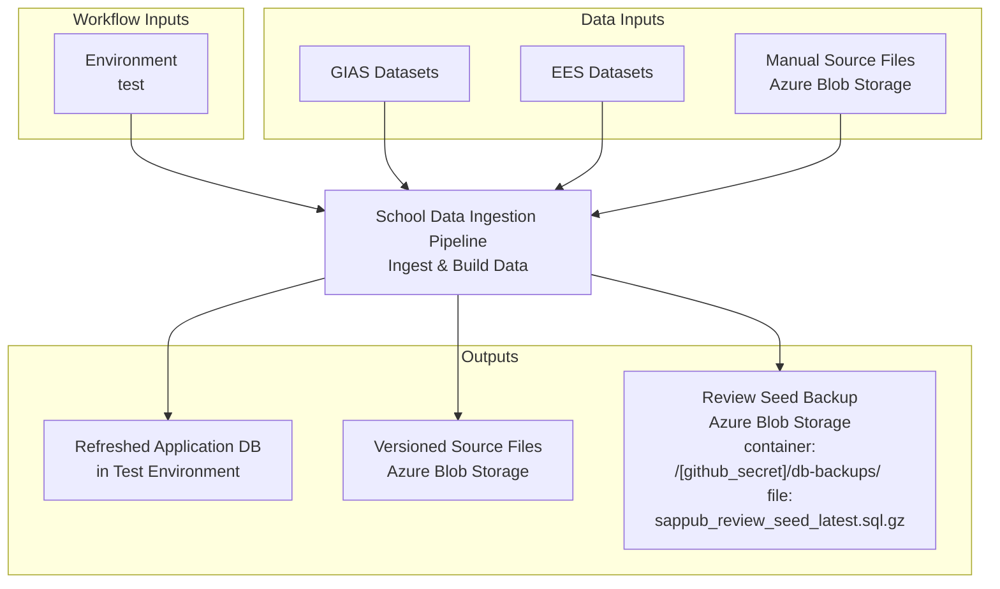
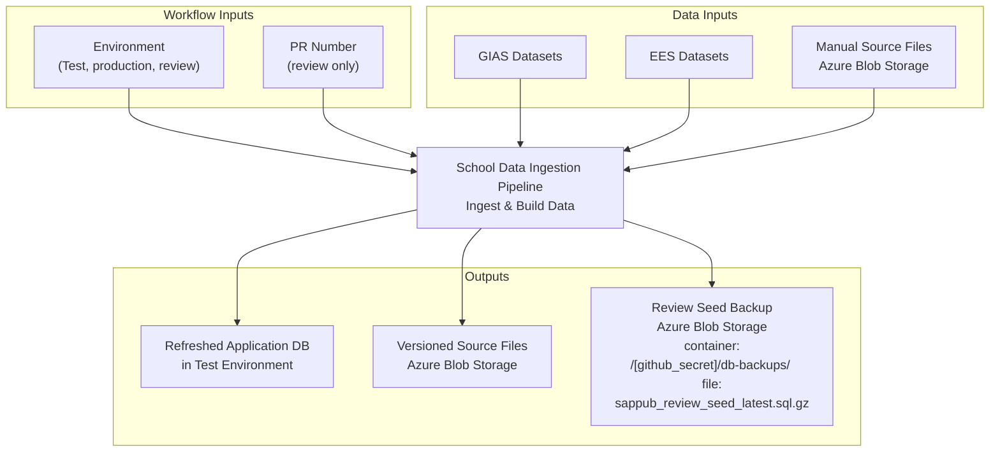

# Data ingestion pipeline

Runs the data ingestion code to read files from BlobStorage and create a database populated with data from the source files. 
The pipeline can be run as a scheduled task or called from another pipeline (e.g. build-and-deploy with refresh-data label).

## When it is run as a scheduled task

## When it is called from another pipeline 
(e.g. build-and deploy with refresh-data label)

