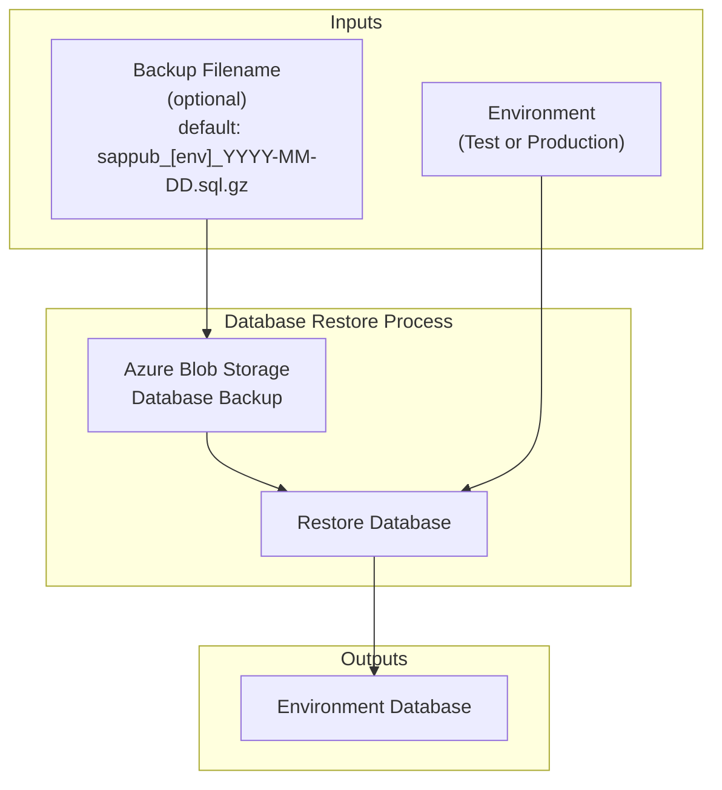

```mermaid
flowchart TD

    subgraph Inputs
        A1["Environment<br/>(Test or Production)"]
        A2["Backup Filename<br/>(optional)<br/> default:<br/>sappub_[env]_YYYY-MM-DD.sql.gz"]
    end

    subgraph Database Restore Process
        B["Azure Blob Storage<br/>Database Backup"]
        C["Restore Database"]

        B --> C
    end

    subgraph Outputs
        D1["Environment Database"]
    end

    A1 --> C
    A2 --> B

    C --> D1
```