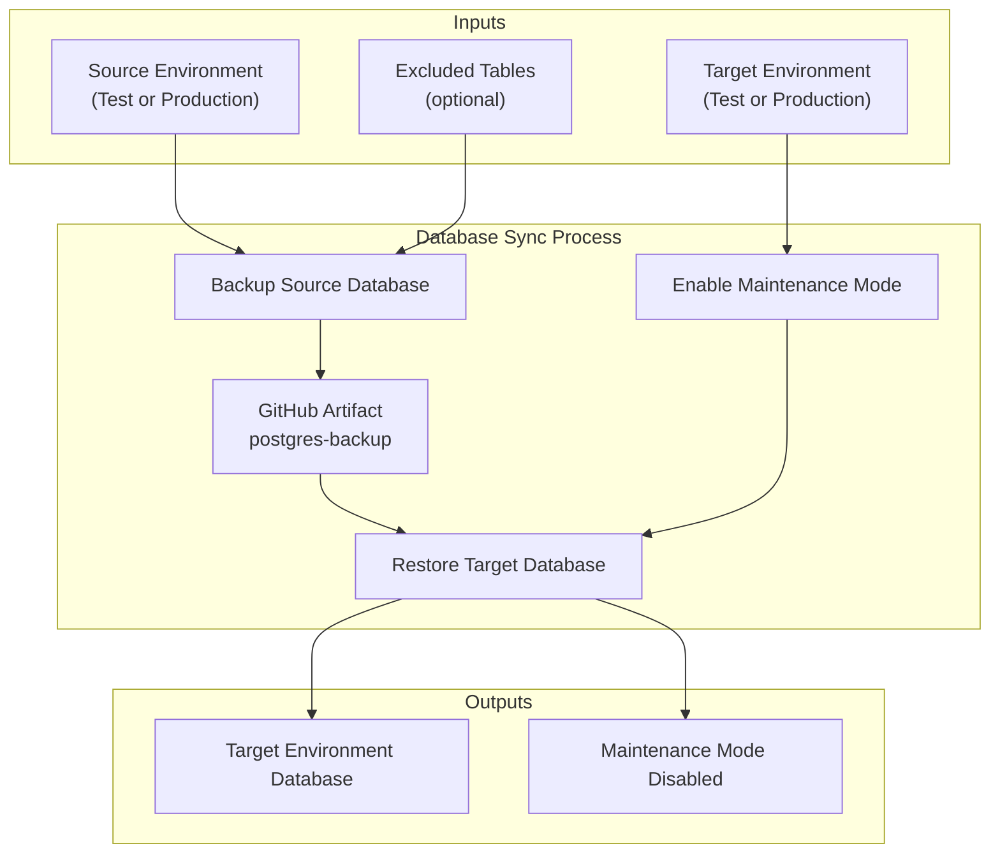

# Sync database workflow

```mermaid
flowchart TD

    subgraph Inputs
        A1["Source Environment<br/>(Test or Production)"]
        A2["Target Environment<br/>(Test or Production)"]
        A3["Excluded Tables<br/>(optional)"]
    end

    subgraph Database Sync Process
        B["Backup Source Database"]
        C["GitHub Artifact<br/>postgres-backup"]
        D["Enable Maintenance Mode"]
        E["Restore Target Database"]

        B --> C
        C --> E
        D --> E
    end

    subgraph Outputs
        F1["Target Environment Database"]
        F2["Maintenance Mode Disabled"]
    end

    A1 --> B
    A3 --> B
    A2 --> D

    E --> F1
    E --> F2
```